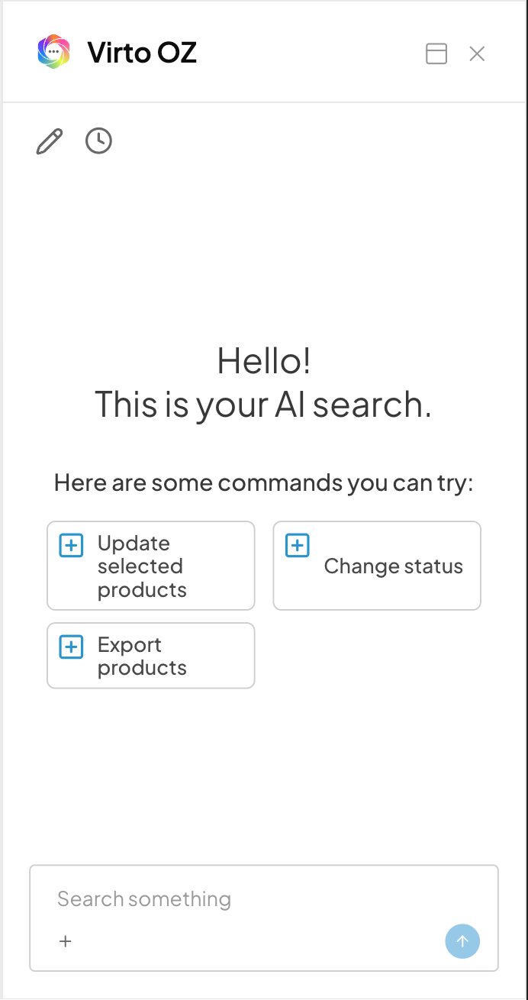

# Integrate the AI Agent

The AI Agent plugin embeds an assistant panel into a VC-Shell app and forwards blade context to it. Wiring it into a new app takes two steps:

1. [Configure the agent URL](#configure-the-agent-url).
2. [Pass blade context](#pass-blade-context).

The plugin is optional. If no URL is provided, the framework silently skips it and the app runs unchanged.

## Configure the agent URL

VC-Shell reads the agent URL from one of three places, in priority order:

1. The `aiAgent.config.url` option passed to `VirtoShellFramework`.
2. The `APP_AI_AGENT_URL` environment variable resolved at build time.
3. Neither — the plugin is skipped.

### Static URL via environment

When the URL is fixed per build, set it in **.env** or **.env.local**:

```bash title=".env.local"
APP_AI_AGENT_URL=https://agent.example.com/chat
```

No bootstrap changes are required. The framework picks up the variable when `VirtoShellFramework` installs.

### Runtime URL from Platform settings

When the URL depends on tenant or environment settings exposed by the Platform, fetch it during bootstrap and pass the resolved value to the framework:

```ts title="src/main.ts"
import { createApp } from "vue";
import VirtoShellFramework from "@vc-shell/framework";
import { RouterView } from "vue-router";
import { router } from "./router";
import { useAppSettings } from "./modules/settings";

async function startApp() {
  const { aiAssistantUrl, loadSettings } = useAppSettings();

  await loadSettings();

  const app = createApp(RouterView);

  app.use(VirtoShellFramework, {
    router,
    aiAgent: {
      config: {
        url: aiAssistantUrl.value,
      },
    },
  });

  app.mount("#app");
}

startApp();
```

`useAppSettings` stands for whatever composable your app uses to load settings from the Platform. The key constraint is to resolve the URL **before** `app.use(VirtoShellFramework)` so the plugin sees it at install time. An empty string is treated the same as "not set" — the plugin skips installation, so a missing setting degrades gracefully.

`config` also accepts `title`, `width`, `expandedWidth`, and `allowedOrigins`. See the [AI Agent plugin reference](../plugins/ai-agent.md#iaiagentconfig) for the full option list.

## Pass blade context

Once the URL is configured, every blade that should participate in AI interactions binds its data to the agent context with `useAiAgentContext`. The composable accepts a single `dataRef` that can be either a single object (details blade) or an array (list blade), plus optional suggestion cards that render as prompt buttons in the panel.

### List blade — selected rows

In a list blade, pass the selection ref so the assistant always sees the rows the user picked. Suggestions describe the bulk actions the assistant can drive on that selection:

```vue title="orders-list.vue"
<script setup lang="ts">
import { ref } from "vue";
import { useAiAgentContext } from "@vc-shell/framework/ai-agent";
import type { CustomerOrder } from "../../../api_client/orders";

const selectedOrders = ref<CustomerOrder[]>([]);

useAiAgentContext({
  dataRef: selectedOrders,
  suggestions: [
    {
      id: "show-selected-data",
      title: "Show selected items data",
      icon: "lucide-database",
      iconColor: "#319ED4",
      prompt: "Show me the data of selected items in JSON format",
    },
    {
      id: "analyze-orders",
      title: "Analyze selected orders",
      icon: "lucide-chart-bar",
      iconColor: "#57AB79",
      prompt: "Analyze the selected orders and provide insights",
    },
  ],
});
</script>
```

The selection ref is the same one bound to `<VcDataTable v-model:selection>`, so the assistant sees exactly what the user sees. When the selection changes, the framework forwards an `UPDATE_CONTEXT` message automatically — no extra wiring required.

### Details blade — single entity

In a details blade, pass the entity ref directly. The composable wraps it in an array internally and forwards the same context the assistant needs to reason about a single item:

```vue title="order-details.vue"
<script setup lang="ts">
import { ref } from "vue";
import { useAiAgentContext } from "@vc-shell/framework/ai-agent";
import type { CustomerOrder } from "../../../api_client/orders";

const order = ref<CustomerOrder>();

useAiAgentContext({
  dataRef: order,
  suggestions: [
    {
      id: "generate-description",
      title: "Generate description",
      icon: "lucide-wand-sparkles",
      iconColor: "#57AB79",
      prompt: "Generate a description for this order based on its line items",
    },
    {
      id: "suggest-improvements",
      title: "Suggest improvements",
      icon: "lucide-lightbulb",
      iconColor: "#FFBA35",
      prompt: "Analyze this order and suggest improvements",
    },
  ],
});
</script>
```

`useAiAgentContext` returns `void`. It wires the watcher and the unmount cleanup; nothing is exposed to the caller.

## Suggestion cards

Each `ISuggestion` has five fields:

| Field       | Type     | Description                                            |
| ----------- | -------- | ------------------------------------------------------ |
| `id`        | `string` | Unique identifier within the blade.                    |
| `title`     | `string` | Label rendered on the suggestion button.               |
| `icon`      | `string` | Lucide icon name, for example, `lucide-wand-sparkles`. |
| `iconColor` | `string` | Optional hex color for the icon.                       |
| `prompt`    | `string` | Text sent to the assistant when the user clicks.       |

The panel renders one card per suggestion above the input box, ordered as you pass them in:

{: style="display: block; margin: 0 auto;" }

Treat suggestions as shortcuts, not as the only way to drive the assistant. The panel always accepts free-form input; suggestions just save the user typing for the most common prompts on this blade.

## Verify the integration

After wiring the plugin and at least one blade, run the app and open the agent panel from the blade toolbar. The panel:

- Loads the agent at the configured URL.
- Shows the suggestion cards declared on the active blade.
- Forwards `INIT_CONTEXT` with the current user, blade name, and bound data.

If the panel does not appear, check that the URL is non-empty at the moment `VirtoShellFramework` installs. If the panel appears but no context arrives, check that `useAiAgentContext` runs inside the blade's `<script setup>`, not inside a child component that mounts conditionally.

## Related

- [AI Agent concept.](../concepts/ai-agent.md)
- [AI Agent plugin reference.](../plugins/ai-agent.md)
