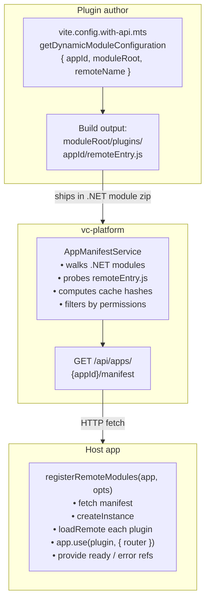
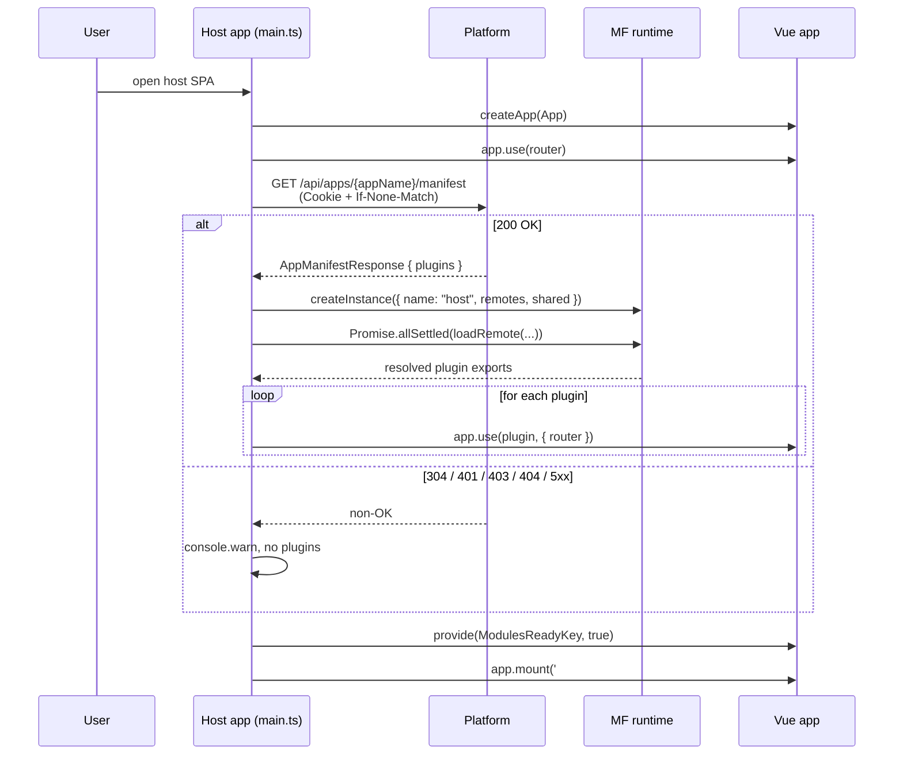

# Module Federation

Add runtime-loaded plugin extensions to a VC-Shell host without rebuilding the host. A plugin is a Vue subpackage that lives inside its own .NET module and ships a Module Federation remote (`remoteEntry.js`). At app boot, the host fetches a Platform-provided manifest, loads each plugin's `remoteEntry.js`, and runs `app.use(plugin, { router })` to install routes, blades, locales, widgets, and notification handlers — exactly as a bundled module would.

This guide covers both sides of the contract: the host app that consumes plugins, and the .NET module that ships a plugin remote.

## When to use

Reach for Module Federation when:

- Plugin shipping is independent from host shipping. Teams or partners deliver .NET modules that bring frontend extensions along, on a different release cycle than the host.
- A single host serves different plugin sets per tenant, per environment, or per deployment cohort.
- The Platform's `<dependency>` graph already governs the plugin's lifecycle — install/uninstall on the Platform side should translate to the plugin appearing or disappearing in the host UI.

Skip it when:

- The module lives in the same repo and ships with the host. Drop it under `src/modules/` and let `app.use()` install it at build time. No registry, no MF runtime.

## Pipeline

A plugin moves from author to user through three layers, each owning a clear part of the contract:



Three packages cover each role:

| Package | Role |
|---|---|
| `@vc-shell/mf-host` | Host loader. Called from the host app's `main.ts`. |
| `@vc-shell/mf-module` | Vite config helper for plugin authors. |
| `@vc-shell/mf-config` | Shared singleton catalogue (Vue, Vue Router, Vue I18n, `@vc-shell/framework` and its subpaths). |

The Platform exposes one endpoint:

```http
GET /api/apps/{appId}/manifest
Cookie: ...                       ← session auth
Accept: application/json
If-None-Match: "<last-etag>"      ← optional; 304 on no-change
```

200 OK response:

```ts
interface AppManifestResponse {
  appId: string;
  version: string;
  title: string;
  plugins: PluginEntry[];        // topologically sorted, permission-filtered
}

interface PluginEntry {
  id: string;                    // defaults to owning .NET module id
  version: string;
  entry: ContentFile;            // remoteEntry.js
  contentFiles: ContentFile[];   // additional preload assets (typically CSS)
  remote: { name: string; exposed: string };
}

interface ContentFile {
  type: "script" | "style";
  path: string;                  // absolute URL served by the platform
  hash?: string;                 // cache-busting hash, append as ?v={hash}
}
```

Status codes the host handles:

| Code | Host behaviour |
|---|---|
| 200 | Load plugins |
| 304 | Browser HTTP cache replays the previous body — transparent |
| 401 / 403 / 404 / 5xx | `console.warn`, `modulesReady=true`, no plugins, no error UI |

Network or parse failures (rejection from `fetch()` itself) set `modulesLoadError=true`.

There is **no client-side semver filter**. The Platform validates plugin compatibility once at .NET module install time via `<dependency>` declarations in `module.manifest`. By the time the host sees a `PluginEntry`, the dependency graph has already been validated.

## Host app guide

### 1. Declare the app on the Platform

Some .NET module must own the host's `<app>` declaration. Without it, `GET /api/apps/{appId}/manifest` returns 404. Example from the marketplace-vendor module:

```xml title="VirtoCommerce.MarketplaceVendorModule.Web/module.manifest"
<apps>
  <app id="vendor-portal">
    <title>Vendor portal</title>
    <iconUrl>/apps/vendor-portal/img/icons/favicon-32x32.png</iconUrl>
    <permission>vendor_portal:access</permission>
  </app>
</apps>
```

The reserved `appId="platform"` is the Platform's own Commerce Manager — declared internally.

### 2. Call `registerRemoteModules` in `main.ts`

```ts title="src/main.ts"
import { createApp } from "vue";
import { registerRemoteModules } from "@vc-shell/mf-host";
import App from "./App.vue";
import { router } from "./router";

const app = createApp(App);
app.use(router);

// Discover and load plugin remotes BEFORE app.mount().
registerRemoteModules(app, {
  router,
  appName: "vendor-portal",      // must match an <app id="..."> on the Platform
});

app.mount("#app");
```

`registerRemoteModules` is fire-and-forget. It returns synchronously and runs the manifest fetch + plugin loading in the background. Components can react to loading state via two refs the function provides through `app.provide()`:

```ts
import { inject } from "vue";
import { ModulesReadyKey, ModulesLoadErrorKey } from "@vc-shell/framework";

const modulesReady = inject(ModulesReadyKey)!;       // Ref<boolean>
const modulesLoadError = inject(ModulesLoadErrorKey)!; // Ref<boolean>
```

- `modulesReady.value === true` once the loading phase has finished (success or graceful skip on non-OK HTTP).
- `modulesLoadError.value === true` only on network or parse failures.

Options:

```ts
interface RegisterRemoteModulesOptions {
  router: Router;
  appName: string;
  manifestUrl?: string;          // defaults to `/api/apps/${encodeURIComponent(appName)}/manifest`
}
```

### 3. Pre-bundle the runtime in Vite config

Add `mfHostConfig()` to your Vite config to pre-bundle the federation runtime and avoid dev-mode full-reloads:

```ts title="vite.config.mts"
import { mergeConfig } from "vite";
import { mfHostConfig } from "@vc-shell/mf-host";

export default mergeConfig(/* your config */, mfHostConfig());
```

## Plugin author guide

### 1. Layout

The .NET module contains a Vue subpackage that builds a federation remote. Two common layouts:

**Single plugin per .NET module** (vite.config at module root):

```
VirtoCommerce.MyModule.Web/
├── module.manifest
├── vite.config.with-api.mts     ← cwd at `yarn build`
├── package.json
├── src/
│   └── modules/index.ts
└── plugins/
    └── vendor-portal/
        └── remoteEntry.js       ← build output
```

**Multi-plugin .NET module** (one Vue subpackage per host app):

```
VirtoCommerce.MyModule.Web/
├── module.manifest
├── frontend-vendor-portal/
│   ├── vite.config.with-api.mts
│   ├── package.json
│   └── src/
├── frontend-system-operations/
│   ├── vite.config.with-api.mts
│   ├── package.json
│   └── src/
└── plugins/
    ├── vendor-portal/remoteEntry.js
    └── system-operations/remoteEntry.js
```

Both produce remotes the Platform discovers at `{moduleRoot}/plugins/{appId}/remoteEntry.js`.

### 2. `vite.config.with-api.mts`

```ts title="vite.config.with-api.mts"
import { fileURLToPath } from "node:url";
import path from "node:path";
import { getDynamicModuleConfiguration } from "@vc-shell/mf-module";

const __dirname = path.dirname(fileURLToPath(import.meta.url));

// Walk up to the .NET module root so the build output lands at
// <moduleRoot>/plugins/<appId>/.
const moduleRoot = path.resolve(__dirname, "../../..");

export default getDynamicModuleConfiguration({
  entry: "./src/modules/index.ts",
  appId: "vendor-portal",                // host app this plugin attaches to
  moduleRoot,                            // absolute path to <moduleRoot>
  remoteName: "VirtoCommerce.MyModule",  // .NET module id (matches PluginEntry.remote.name)
});
```

Options on `DynamicModuleOptions`:

| Field | Purpose | Default |
|---|---|---|
| `appId` | Platform app identifier (e.g. `"vendor-portal"`). Determines the build output path: `<moduleRoot>/plugins/<appId>/`. | Required |
| `moduleRoot` | Absolute path to the .NET module root. Combined with `appId` to compute the final `outDir`. | `process.cwd()` |
| `remoteName` | Federation `name` for this remote. Must equal `remote.name` returned by the Platform manifest. | `pkg.name` (npm package name) |
| `entry` | Module entry point. | `"./src/modules/index.ts"` |
| `exposes` | Custom federation exposes map. Overrides default `{ "./Module": entry }`. | `{ "./Module": entry }` |

### 3. Entry point

Default-export a Vue plugin (or a collection of plugins). `registerRemoteModules` calls `app.use(...)` on whatever is exported. The simplest form:

```ts title="src/modules/index.ts"
import type { App } from "vue";
import type { Router } from "vue-router";
import routes from "./routes";

export default {
  install(app: App, { router }: { router: Router }) {
    routes.forEach((route) => router.addRoute(route));
    // Register your widgets, blades, services, locales, etc.
  },
};
```

Multiple sub-modules (collection format) are also supported:

```ts
import { Rating } from "./rating";
import { Orders } from "./orders";

export default { Rating, Orders };
// Both `Rating` and `Orders` must have install(app, opts).
```

### 4. Federation `name` vs npm package name

Two strings must align across the system:

| Where | What | Default |
|---|---|---|
| `vite.config` → `federation.name` | The remote's MF name | `pkg.name` (npm) — overridable via `remoteName` |
| Platform manifest → `remote.name` | Platform's view of this remote | .NET module id from `module.manifest` |

The .NET module id and the npm package name are usually different (e.g. `VirtoCommerce.MarketplaceQuote` vs `vcmp-quote`). Pass `remoteName` explicitly to align them.

### 5. Federation `exposed` key

The default `exposes` map uses `"./Module"` (capital M) — this matches the Platform's `DefaultExposedModule`. Override only when you need a different key:

```ts
getDynamicModuleConfiguration({
  // ...
  exposes: { "./CustomEntry": "./src/custom.ts" },
});
```

If the plugin declares `<plugin>` metadata on the Platform side with a non-default `exposed`, that string must equal the key in your `exposes` map.

### 6. Build and ship

Add the bundle build to `package.json` scripts:

```json title="package.json"
{
  "scripts": {
    "build": "yarn build:app && yarn build:types && yarn build:modules-bundle",
    "build:modules-bundle": "vite build --config ./src/modules/vite.config.with-api.mts"
  }
}
```

`yarn build:modules-bundle` produces `<moduleRoot>/plugins/<appId>/remoteEntry.js` plus chunks and assets. Add the output to `.gitignore`:

```gitignore title=".gitignore"
# MF plugin remote build output (Platform manifest discovery folder)
src/VirtoCommerce.MyModule.Web/plugins/
```

### 7. Ship `plugins/` inside the .NET module package

The federation remote is only useful if it ends up inside the `.zip` artifact the Platform installs. Two things must be true:

**a. CI builds the frontend before `vc-build Compress`** — the .NET pipeline does not run `yarn` for you. Add a step to your module's GitHub Actions workflow (`.github/workflows/module-ci.yml`) before the `vc-build Compile` step:

```yaml title=".github/workflows/module-ci.yml"
- name: Install <module> app dependencies
  working-directory: src/VirtoCommerce.<ModuleId>.Web/<frontend-subpkg>
  run: yarn

- name: Build <module> app (standalone host + MF plugin remote)
  working-directory: src/VirtoCommerce.<ModuleId>.Web/<frontend-subpkg>
  run: yarn build
```

Most existing marketplace modules expose this as a local composite action (`.github/actions/build-<module>-module/`) — either pattern works.

**b. `.csproj` copies `plugins/**` into the published module folder** — `vc-build Compress` packs whatever `dotnet publish` leaves next to `module.manifest`. The federation output sits at `<moduleRoot>/plugins/<appId>/` (sibling to the `.csproj`), so add an explicit copy target:

```xml title="VirtoCommerce.MyModule.Web.csproj"
<ItemGroup>
  <!-- existing copies of NotificationTemplates, standalone app dist, etc. stay as-is -->
  <NotificationTemplates Include="NotificationTemplates\**" />
  <StandaloneApp Include="<frontend-subpkg>\dist\**" />
  <!-- MF plugin remote produced by `yarn build:modules-bundle` lands at
       <moduleRoot>/plugins/<appId>/ — the Platform's manifest endpoint
       (GET /api/apps/<appId>/manifest) discovers remoteEntry.js there. -->
  <PluginRemotes Include="plugins\**" />
</ItemGroup>
<Target Name="CopyCustomContentOnPublish" AfterTargets="Publish">
  <Copy SourceFiles="@(NotificationTemplates)" DestinationFiles="$(PublishDir)\..\%(Identity)" />
  <Copy SourceFiles="@(StandaloneApp)" DestinationFiles="$(PublishDir)\..\%(Identity)" />
  <Copy SourceFiles="@(PluginRemotes)" DestinationFiles="$(PublishDir)\..\plugins\%(RecursiveDir)%(Filename)%(Extension)" />
</Target>
```

The `%(RecursiveDir)` part preserves the `<appId>/` subfolder so the final zip layout is `plugins/<appId>/remoteEntry.js` — exactly where the Platform looks.

After both pieces land, run `yarn build:modules-bundle` once locally, then `dotnet publish`, and verify the publish output contains `plugins/<appId>/remoteEntry.js` next to `module.manifest`. The next CI run will produce a module zip with the plugin remote inside.

## Boot sequence

When the user opens the host app, the plugins load in this order:



The mount happens regardless of plugin outcome — a Platform 404 (no plugins for this host) is not a failure mode; it just yields a host without extensions.

## Shared dependencies

`@vc-shell/mf-config` defines the canonical shared-singleton catalogue used by both host and remote builds. It exports:

- `SHARED_DEPS_BASE` — the master list (Vue, Vue Router, Vue I18n, vee-validate, lodash-es, `@vueuse/core`, `@vc-shell/framework`, and its subpaths).
- `DEFAULT_SHARED` — host-side config (bundles fallbacks; provides shared deps to remotes).
- `REMOTE_SHARED` — remote-side config (`import: false`; relies entirely on the host).

Plugin authors should not modify this catalogue. If a remote needs an additional shared dep, lift it to `@vc-shell/mf-config` so the host and other plugins agree on the same singleton.

Subpath exports of `@vc-shell/framework` (e.g. `@vc-shell/framework/ui`) are listed individually because MF matches `shared` by exact import specifier — without them, every `import ... from "@vc-shell/framework/ui"` in a remote would bundle a duplicate framework copy and break `provide/inject` DI.

## Troubleshooting

| Symptom | Likely cause |
|---|---|
| `404` on `GET /api/apps/{appId}/manifest` | No .NET module declares `<app id="{appId}">`. Check the host's owning module's `module.manifest`. |
| `Module ./Module does not exist in container` | Plugin's `exposes` map uses a different key than the Platform's `remote.exposed`. Default both to `"./Module"`. |
| Plugin loads but `app.use` is never called | Plugin's entry does not default-export an object with `install(app, opts)`, or does not match one of the supported collection shapes. |
| Platform returns `remote.name = "X"` but `loadRemote` fails | `federation.name` in the plugin's Vite config does not match. Set `remoteName` explicitly. |
| Host boots without plugins after upgrade | Manifest returned non-OK (401 / 403 / 404 / 5xx). Check the browser network tab — the host logs a `console.warn` with the URL and status. |
| Locally everything works, on production the plugin is missing from `GET /api/apps/{appId}/manifest` | The .NET module zip shipped to production does not contain `plugins/{appId}/remoteEntry.js`. Either CI is not running `yarn build:modules-bundle`, or the `.csproj` does not copy `plugins/**` into the publish output. See [Ship `plugins/` inside the .NET module package](#7-ship-plugins-inside-the-net-module-package). |
| Browser refetches the entire bundle on every reload | Platform is not emitting an `ETag`. Verify the manifest controller is enabled and the Platform is not in dev mode (dev disables 304 to make `yarn build` cycles visible). |

## Related

- [Back-Office UI Modularity (Platform contract).](../../../../Fundamentals/Modularity/07-backoffice-app-modularity.md)
- [Declaring settings in module.manifest.](../../../../Fundamentals/Modularity/06-module-manifest-file.md#declaring-settings)
- [Module Federation concept.](../../concepts/module-federation.md)
- [Deployment of the host app.](../deployment.md)
- [Modularity plugin reference.](../../plugins/modularity.md)
- [Extension points.](../../concepts/extensions.md)
