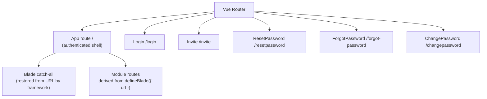

# Routing

Configure app-level routes, integrate with blade navigation, and wire shared pages like Login and Dashboard.

## Prerequisites

Before configuring the router, make sure you have:

- Familiarity with Vue Router 4.
- A scaffolded VC-Shell app, with **src/router/** already in place.

## How routing fits together

VC-Shell layers three kinds of routes on top of Vue Router. Top-level routes in **routes.ts** define the App shell and the unauthenticated pages, like Login and Invite. The blade catch-all under the App route is registered automatically by the framework and forwards unknown URLs to the blade restoration pipeline. Per-blade routes are derived from each blade's `url` field by `defineAppModule`. You author the first layer; the framework owns the other two.



## App-level routes

The scaffolded **src/router/routes.ts** wires top-level pages. The App route is the authenticated shell that renders the blade workspace, the sidebar, and the top bar. Login and the other auth pages live at the top level so they render without the shell.

```ts title="src/router/routes.ts"
import { RouteRecordRaw } from "vue-router";
import App from "../pages/App.vue";
import Dashboard from "../pages/Dashboard.vue";
import { Invite, Login, ResetPassword, ForgotPassword, ChangePasswordPage } from "@vc-shell/framework";
import whiteLogoImage from "/assets/logo-white.svg";

export const routes: RouteRecordRaw[] = [
  {
    name: "App",
    path: "/",
    component: App,
    meta: { root: true },
    children: [
      {
        name: "Dashboard",
        path: "",
        alias: "/",
        component: Dashboard,
      },
      // Blade catch-all is added by the framework. Do not list it here.
    ],
  },
  {
    name: "Login",
    path: "/login",
    component: Login,
    props: () => ({ logo: whiteLogoImage, title: "My App" }),
  },
  {
    name: "Invite",
    path: "/invite",
    component: Invite,
    props: (r) => ({ userId: r.query.userId, token: r.query.token, userName: r.query.userName, logo: whiteLogoImage }),
  },
  {
    name: "ResetPassword",
    path: "/resetpassword",
    component: ResetPassword,
    props: (r) => ({ userId: r.query.userId, token: r.query.token, userName: r.query.userName, logo: whiteLogoImage }),
  },
  {
    name: "ForgotPassword",
    path: "/forgot-password",
    component: ForgotPassword,
    props: () => ({ logo: whiteLogoImage }),
  },
  {
    name: "ChangePassword",
    path: "/changepassword",
    component: ChangePasswordPage,
    meta: { forced: true },
    props: (r) => ({ forced: r.meta.forced, logo: whiteLogoImage }),
  },
];
```

The `meta: { root: true }` flag on the App route is load-bearing. The framework looks for it to anchor the blade catch-all and to gate the auth guard. Removing it disables blade navigation.

## Blade routes

Every blade with a `url` field gets a route. `defineAppModule` reads the static config off each blade component and registers it through the blade registry; the framework then adds a catch-all under the App route that handles deep links.

```vue title="src/modules/orders/pages/OrdersList.vue"
<script setup lang="ts">
import { useBlade } from "@vc-shell/framework";

defineBlade({
  name: "OrdersList",
  url: "/orders",        // becomes the URL segment for this workspace
  isWorkspace: true,
});
</script>
```

Only blades that declare a `url` produce URL segments. Child blades opened with `openBlade` without a `url` ride on top of the parent's URL and do not change the address bar.

## Auth and permission guards

The framework installs two `router.beforeEach` guards. The first checks `isAuthenticated` whenever a route under `meta.root` is entered. Anonymous users are redirected to **Login**, and the original path is stashed in `localStorage` under `redirectAfterLogin` so the post-login flow can return them. The second guard checks `meta.permissions` against `usePermissions().hasAccess`. A failure shows the `PERMISSION_MESSAGES.ACCESS_RESTRICTED` toast and bounces the user back to the previous path.

The blade router guard runs on top of these, separately, to restore the blade stack from the URL whenever the catch-all matches.

## Tenant routing

When you scaffold with `--tenant-routes`, the App route is generated with a UUID-shaped `:tenantId` parameter and the Dashboard alias mirrors it. All blade URLs nest under the tenant prefix automatically.

```ts title="src/router/routes.ts (with --tenant-routes)"
const tenantIdRegex = "[0-9a-fA-F]{8}-[0-9a-fA-F]{4}-[0-9a-fA-F]{4}-[0-9a-fA-F]{4}-[0-9a-fA-F]{12}";

{
  name: "App",
  path: `/:tenantId(${tenantIdRegex})?`,
  component: App,
  meta: { root: true },
  children: [
    {
      name: "Dashboard",
      path: "",
      alias: `/:tenantId(${tenantIdRegex})?`,
      component: Dashboard,
    },
  ],
}
```

The blade router guard reads the first route param as the tenant prefix and preserves it across blade navigations and fallback redirects.

## URL synchronization

Every blade with a `url` segment can be reflected in the address bar. Deep-linking opens the matching routable blade. Non-URL child blades ride on top of the parent's route, do not change the address bar, and are not restored after a hard refresh. Treat browser Back and Forward as route navigation, not as a complete blade-stack history.

- [URL sync details.](../concepts/blade-navigation.md#url-synchronization)

## Common mistakes

!!! warning "Adding a blade route to routes.ts manually"
    `defineAppModule` registers blade routes through the blade registry; the framework then mounts a catch-all that resolves them. Adding the same path by hand creates a duplicate that competes with the catch-all and breaks deep-link restoration.

!!! warning "Wrong children placement"
    Pages that should appear inside the app shell must be children of the App route. A page placed at the top level renders without the sidebar and top bar, like the Login page does.

!!! warning "Removing meta.root from the App route"
    The framework anchors the blade catch-all and the auth guard on `meta: { root: true }`. Without it, blade navigation does not work and the auth guard never fires.

- [How modules register routes.](../concepts/modules.md)

- [Wiring shared auth pages.](platform/auth-pages.md)
