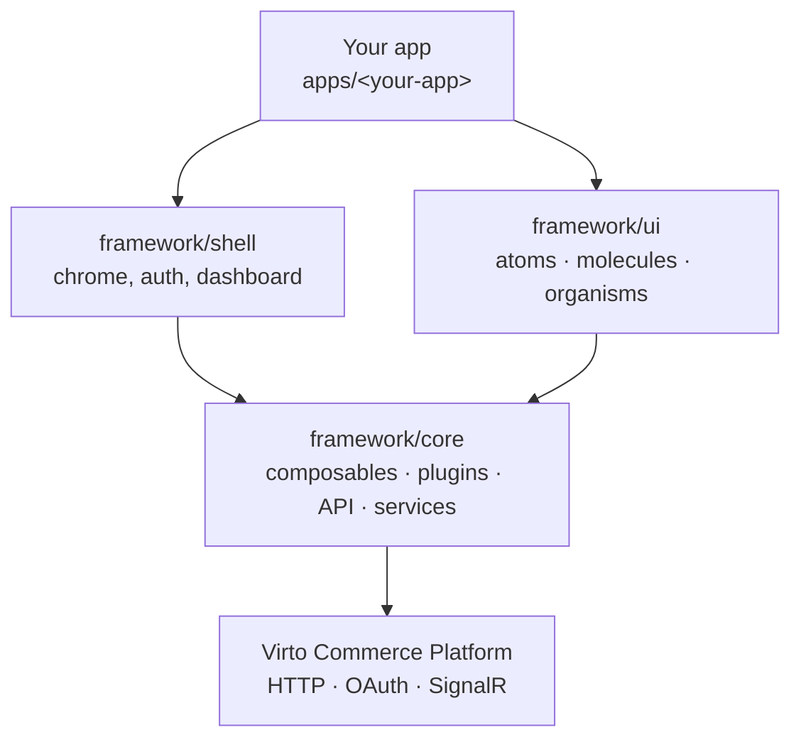

# Architecture Overview

VC-Shell is layered. Dependency direction flows top to bottom; the rule is enforced by `yarn check:layers`.



| Layer | Responsibility | Constraints |
| --- | --- | --- |
| `framework/core`. | API clients, composables, services (menu, toolbar, settings, notifications), plugins (modularity, extensions, permissions, i18n, SignalR), blade navigation engine. | No imports from `shell` or `ui`. |
| `framework/ui`. | Atomic Design components including `VcBlade`, `VcDataTable`, `VcForm`. | No imports from `shell`. |
| `framework/shell`. | Sidebar, top bar, dashboard, settings, auth layout, blade rendering glue. | May depend on `core` and `ui`. |
| Your app. | Modules, custom blades, business logic, app-specific config. | Depends on everything below. |

Enforcement rules: [`scripts/check-layer-violations.ts`](https://github.com/VirtoCommerce/vc-shell/blob/main/scripts/check-layer-violations.ts).

## Blade architecture

Blade navigation combines compile-time metadata with a runtime stack.

| Component | File | Role |
| --- | --- | --- |
| `defineBlade` macro. | [`configs/vite-config/src/plugins/viteBladePlugin.ts`](https://github.com/VirtoCommerce/vc-shell/blob/main/configs/vite-config/src/plugins/viteBladePlugin.ts). | Rewrites the script so that the blade's config (name, URL, menu item, permissions) lands in the `BladeRegistry` before mount. |
| `defineAppModule`. | [`framework/core/plugins/modularity/index.ts`](https://github.com/VirtoCommerce/vc-shell/blob/main/framework/core/plugins/modularity/index.ts). | Registers blades, locales, and notifications during `app.use(...)`. |
| `useBladeStack`. | [`framework/core/blade-navigation/useBladeStack.ts`](https://github.com/VirtoCommerce/vc-shell/blob/main/framework/core/blade-navigation/useBladeStack.ts). | The state machine: `openWorkspace`, `openBlade`, `closeBlade`, `closeChildren`, `replaceCurrentBlade`, `coverCurrentBlade`. |
| `useBladeMessaging`. | [`framework/core/blade-navigation/useBladeMessaging.ts`](https://github.com/VirtoCommerce/vc-shell/blob/main/framework/core/blade-navigation/useBladeMessaging.ts). | Parent-child method dispatch by `bladeId`. |
| URL sync. | [`framework/core/blade-navigation/utils/`](https://github.com/VirtoCommerce/vc-shell/tree/main/framework/core/blade-navigation/utils). | Every blade with a `url` segment is reflected in the address bar. |
| `useBlade()`. | [`framework/core/composables/useBlade/index.ts`](https://github.com/VirtoCommerce/vc-shell/blob/main/framework/core/composables/useBlade/index.ts). | The everyday API. Works inside and outside blade context. |

Developer-facing walkthrough: [Blade Navigation](../concepts/blade-navigation.md).

{: width="25"} Blade navigation in depth.

## Module model

Modules are Vue plugins. `defineAppModule(options)` accepts:

| Option | Purpose |
| --- | --- |
| `blades`. | Blade components to register. |
| `locales`. | Translation bundles merged into `vue-i18n`. |
| `notifications`. | Notification type configurations. |
| `notificationTemplates`. | Legacy path. |

Built-in modules live under [`framework/modules/`](https://github.com/VirtoCommerce/vc-shell/tree/main/framework/modules). The legacy adapter `createAppModule(...)` delegates to `defineAppModule(...)`.

{: width="25"} Modules in depth.

## Extension points

```ts
// Host blade declares a slot.
defineExtensionPoint("seller:commissions");

// Consumer module registers components against it.
useExtensionPoint("seller:commissions").register({ id, component, priority });
```

Registration is order-independent — modules may register before the host declares the slot. Host receives a reactive, priority-sorted list.

## Module Federation

Three packages cooperate:

| Package | Role |
| --- | --- |
| `@vc-shell/mf-config`. | Shared dependency catalog. |
| `@vc-shell/mf-module`. | Vite config generator for remotes. Emits `remoteEntry.js`. |
| `@vc-shell/mf-host`. | Runtime loader: `POST /api/frontend-modules`, semver filter, parallel load, `app.use(plugin)` for each. |

Standalone apps skip MF and bundle modules at build time. Host apps load remotes through `registerRemoteModules`.

## Public API surface

| Subpath | Use |
| --- | --- |
| `@vc-shell/framework`. | Framework plugin, blade APIs, composables. |
| `@vc-shell/framework/ui`. | Component library. |
| `@vc-shell/framework/ai-agent`. | AI agent integration. |
| `@vc-shell/framework/extensions`. | Extension-point APIs. |

**Framework bootstrap.** `app.use(VirtoShellFramework, options)` runs a fixed sequence: register the base theme, install `fetch` interceptors, initialize `vue-i18n` and merge framework locales, provide breakpoints, create core services (`widget`, `toolbar`, `menu`, `settings`, notifications), create the `BladeRegistry`, install the blade navigation plugin and the built-in modules (SignalR, permissions, touch events, AI agent), provide App Insights options, install global error handlers, start connection and slow-network composables, and register the router guards (auth + permissions). Authoritative source: [`framework/index.ts`](https://github.com/VirtoCommerce/vc-shell/blob/main/framework/index.ts).

## Source of truth

When this page drifts, treat these as authoritative:

| Concern | File |
| --- | --- |
| Runtime bootstrap. | [`framework/index.ts`](https://github.com/VirtoCommerce/vc-shell/blob/main/framework/index.ts). |
| Blade runtime. | [`framework/core/blade-navigation/`](https://github.com/VirtoCommerce/vc-shell/tree/main/framework/core/blade-navigation), [`framework/core/composables/useBlade/`](https://github.com/VirtoCommerce/vc-shell/tree/main/framework/core/composables/useBlade). |
| Module registration. | [`framework/core/plugins/modularity/index.ts`](https://github.com/VirtoCommerce/vc-shell/blob/main/framework/core/plugins/modularity/index.ts). |
| Extension points. | [`framework/core/plugins/extension-points/`](https://github.com/VirtoCommerce/vc-shell/tree/main/framework/core/plugins/extension-points). |
| MF runtime. | [`packages/mf-host/src/register-remote-modules.ts`](https://github.com/VirtoCommerce/vc-shell/blob/main/packages/mf-host/src/register-remote-modules.ts). |
| MF shared and build config. | [`packages/mf-config/src/shared-deps.ts`](https://github.com/VirtoCommerce/vc-shell/blob/main/packages/mf-config/src/shared-deps.ts), [`packages/mf-module/src/dynamic-module-config.ts`](https://github.com/VirtoCommerce/vc-shell/blob/main/packages/mf-module/src/dynamic-module-config.ts). |
