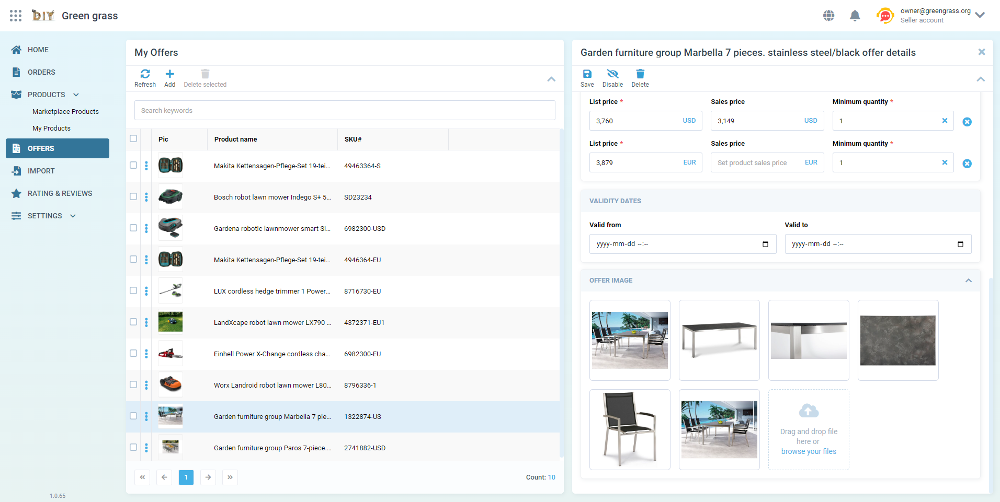

# VC-Shell

Vue 3 frontend framework for building back-office applications on the Virto Commerce Platform.

VC-Shell gives you the chrome around your business logic: an authenticated app shell, a blade-paradigm navigation engine, an Atomic Design component library, a dynamic module loader, and ready-to-wire integration with OAuth, permissions, i18n, SignalR, and the Platform's API surface. You focus on modules; the framework handles routing, layout, state plumbing, and Platform connectivity.

Apps you build with VC-Shell run as standalone Vue 3 bundles or as remote Module Federation modules loaded by an existing host. The same code targets the Virto Commerce admin portal, vendor-facing marketplace consoles, and any internal tool that needs to read or write Platform data.

You stay in the Vue 3 ecosystem the whole way through: Composition API, TypeScript, Vue Router, Pinia, Vite. VC-Shell does not replace those tools; it composes them into a back-office-shaped starting point so the first screen you ship looks and behaves like the rest of the Virto Commerce experience.

{: width="25"} What is VC-Shell.

```bash
npx @vc-shell/create-vc-app my-app
cd my-app && yarn install && yarn serve
```

{: style="display: block; margin: 0 auto;" }

## What you build with it

- Data-management modules: list and details screens, bulk operations, custom dynamic properties.
- Workflow-driven back office: wizards, multi-step approvals, dashboards with widgets.
- Vendor and partner portals that expose a slice of the Platform to external users.
- Standalone bundles or remote Module Federation modules loaded by an existing host.

{: width="25"} Architecture overview.

## Live components

<div class="vc-storybook-embed" style="--height: 420px">
  <iframe
    src="https://vc-shell-storybook.govirto.com/iframe.html?id=action-vcbutton--all-variants&viewMode=story"
    width="100%"
    height="100%"
    frameborder="0"
  ></iframe>
</div>

Full catalog: [Storybook](https://vc-shell-storybook.govirto.com/).

{: width="25"} Install and run your first app.
