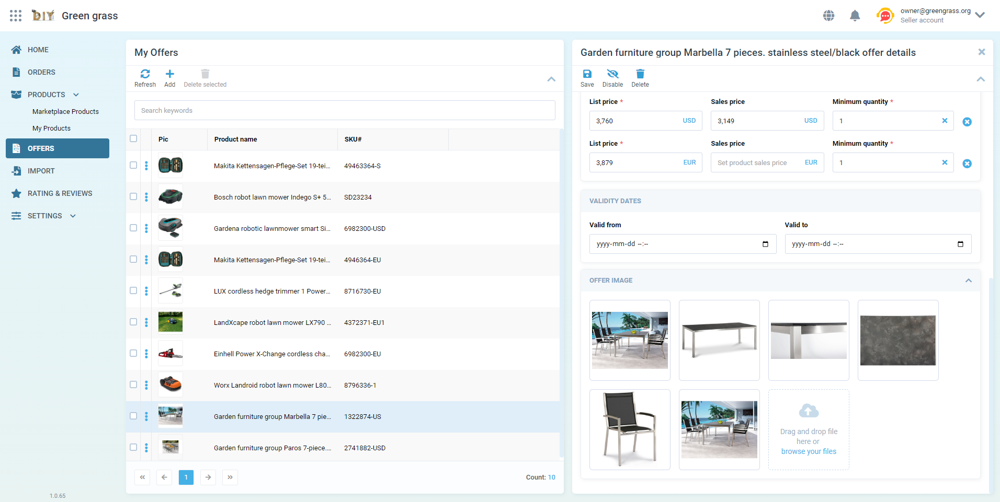

# VC-Shell Overview

[VC-Shell Framework](https://github.com/VirtoCommerce/vc-shell) for specialized back-office applications is created to replace the current VC Platform manager concept.

VC-Shell is a modern framework for building specialized back-office applications using Vue 3. It provides a set of reusable components, services, and utilities designed to simplify and speed up the development of custom business applications.

## Purpose

VC-Shell was created to replace the AngularJS-based VirtoCommerce Platform manager with a modern Vue 3 implementation. The key goals of the framework are:

- Technological modernization from AngularJS to Vue 3
- Modular architecture with separate packages and release cycles
- Simplified customization for specialized back-office applications
- Consistent design system with reusable components

## Key features

- **Modular architecture**: Enables developing independent blocks of functionality (modules), enhancing scalability and maintainability.
- **Reusable components**: Offers an extensive library of pre-built UI components for creating consistent user interfaces.
- **Service system**: Provides extensible services for common business logic and integrations.
- **Theming support**: Allows flexible appearance customization using CSS variables and Tailwind CSS.
- **TypeScript integration**: Features full TypeScript support for increased code reliability and an improved developer experience.
- **Responsive design**: Components and layouts are adapted for correct display on various devices.
- **Internationalization**: Includes built-in multi-language support for global applications.

## Tech stack

- **Vue 3**: Progressive JavaScript framework for building user interfaces
- **TypeScript**: Static typing for improved maintainability and developer experience
- **Vite**: Fast build tooling for modern web projects
- **Yarn Berry**: Package manager with support for monorepo architecture
- **Tailwind CSS**: Utility-first CSS framework
- **Storybook**: Development environment for UI components

## Framework structure

The VC-Shell framework itself is organized into several key internal directories within its own codebase (typically found under a `framework/` path in the monorepo). Understanding this internal structure can be helpful for advanced customization or contributions to the framework:

- **core**: Core functionality including API clients, services, and global utilities.
- **ui**: User interface components organized using atomic design principles.
- **shared**: Shared components, composables, and utilities used across the framework.
- **assets**: Static assets like base styles, images, and icons for the framework itself.
- **locales**: Default internationalization resources for framework elements.

{: width="25"} [Application architecture best practices](Guides/application-architecture-best-practices.md)

{: width="25"}  [Creating Your First Custom Application](Getting-started/creating-first-custom-app.md)

