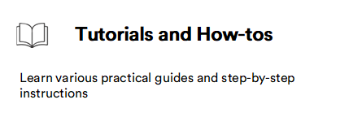

# Overview

This segment will help you learn how to set up, build, develop, and maintain your Virto solutions. Below are some core features of the Platform:

|Step|Description|
|---|---|
|  |Before installation: <ul><li> [Explore system requirements](Getting-Started/system-requirements.md)</li><li> [Learn about skills required for VC developers](skills-required-for-VC-developers.md)</li></ul>   Install on:<ul><li>[Windows](Getting-Started/Installation-Guide/windows.md), [Linux](Getting-Started/Installation-Guide/linux.md), [macOS](Getting-Started/Installation-Guide/macOS.md)</li></ul>   After installation: <ul><li>[Set up self-signed SSL certificate](Getting-Started/Post-Installation-Steps/01-setting-up-self-signed-ssl-cert.md)</li> <li>[Configure email notifications](Getting-Started/Post-Installation-Steps/02-configuring-email-notifications.md)</li> <li>[Configure asset blob storage](Getting-Started/Post-Installation-Steps/03-configuring-asset-blob-storage.md)</li><li>[Import sample data](Getting-Started/Post-Installation-Steps/04-importing-sample-data.md)</li></ul>|
|  |  <ul><li> [Explore our technology stack](Back-End-Architecture/01-tech-stack.md)</li><li> [Learn about Platform core components](Back-End-Architecture/02-conceptual-overview.md) </li></ul>|
|  | <ul><li> [Cache application data](Fundamentals/Caching/01-overview.md)</li><li> [Import data to your application](Fundamentals/Data-Import/01-main-concept.md) </li> <li>[Index data](Fundamentals/Indexed-Search/overview.md)</li> <li>[Discover database agnostic architecture](Fundamentals/Persistence/DB-Agnostic/overview.md)</li><li>[Explore our modular architecture](Fundamentals/Modularity/01-overview.md) and [scalability options](Fundamentals/Scalability/scalability-options.md)</li><li>[Register new payment](Fundamentals/Payments/new-payment-method-registration.md), [shipment methods](Fundamentals/Shipments/new-shipping-method-registration.md), [tax providers](Fundamentals/Taxes/new-tax-provider-registration.md)</li><li>[Manage dynamic properties](Fundamentals/Dynamic-Properties/overview.md) and [notifications](Fundamentals/Notifications/overview.md)</li> <li> [Learn our authentication](Fundamentals/Security/authentication/access-token-and-cookie-mixed-auth.md) and [authorization flows](Fundamentals/Security/authorization/overview.md)</li> <li> [Explore logging libraries](Fundamentals/Logging/overview.md)</li></ul>|
|  | <ul><li> [Extend domain and business logic](Tutorials-and-How-tos/Tutorials/extending-domain-models.md)</li><li> [Extend Platform UI](Platform-Manager/Extensibility-Points/extending-main-menu.md) </li> <li>[Extend authorization policies](Fundamentals/Security/extensions/extending-authorization-policies.md)</li> <li>[Extend authorization policies](Fundamentals/Security/extensions/extending-authorization-policies.md)</li> <li>[Extend database model](Tutorials-and-How-tos/Tutorials/extending-database-model.md)</li> </ul>|
|  |  <ul><li> [Explore appsettings.json file](Configuration-Reference/appsettingsjson.md)</li></ul>|
|  | <ul><li> [REST API](https://virtostart-demo-admin.govirto.com/docs/index.html)</li><li> [GraphQL API](GraphQL-Storefront-API-Reference-xAPI/index.md)</li> <li>[Interact with REST API via Swagger](Tutorials-and-How-tos/How-tos/swagger-api.md)</li> <li>[Interact with GraphQL API via Playground](GraphQL-Storefront-API-Reference-xAPI/playground.md), [curl](GraphQL-Storefront-API-Reference-xAPI/curl.md), or [Postman](GraphQL-Storefront-API-Reference-xAPI/postman.md) </li></ul>|
|  |  <ul><li> [Create custom modules from template](Tutorials-and-How-tos/Tutorials/creating-custom-module.md), [from scratch](Tutorials-and-How-tos/Tutorials/create-new-module-from-scratch.md) or [via Docker](Tutorials-and-How-tos/How-tos/docker-modules-development.md)</li><li> [Debug VC code without source code](Tutorials-and-How-tos/How-tos/debugging.md) </li> <li>[Perform health checks](Tutorials-and-How-tos/How-tos/health-checks.md)</li></ul>|
|  |  <ul><li> [Explore Virto Commerce Global Tool](CLI-tools/overview.md)</li><li> [Explore how to interact with VirtoCloud](CLI-tools/virto-cloud.md) </li> <li>[Install, update, and uninstall platform dependencies](CLI-tools/package-management.md)</li></ul>|
|  |  <ul><li> [Create first custom app via VC Shell](custom-apps-development/vc-shell/Getting-started/creating-first-custom-app.md)</li> <li>[Connect to Platform](custom-apps-development/vc-shell/How-tos/Connecting-to-Platform.md) </li> <li>[Generate API client](custom-apps-development/vc-shell/How-tos/generate-api-client.md)</li></ul>|

