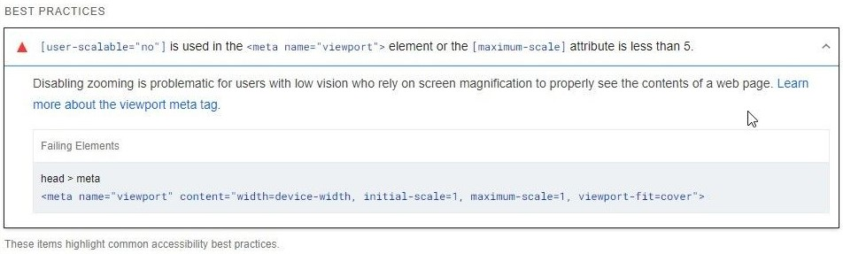

# ADA Compliance

In the Virto Commerce Platform, zooming and scaling can not be disabled for login, Cart, and Catalog pages. This feature ensures that the Virto Commerce Platform is compliant with the Americans with Disabilities Act (ADA) by allowing users to zoom and scale the interface.  It also ensures that all users, including those with visual impairments, can adjust the size of the content on the platform to improve readability and usability. It also adheres to accessibility guidelines that require web content to be accessible to people with disabilities:

