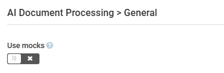
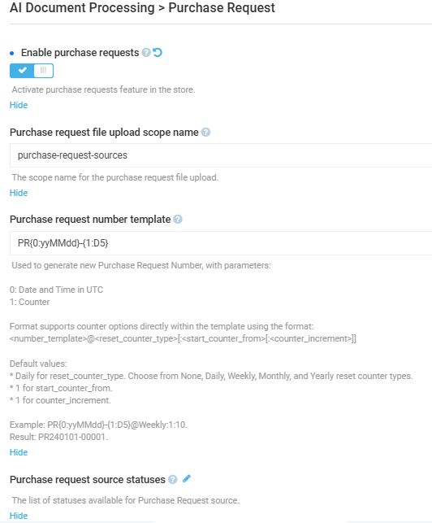

# Settings

To open the AI Document Processing module general settings:

1. Click **Settings** in the main menu.
1. In the search field of the next blade, type **AI Document Processing** to find the settings related to the module.
1. Click **General** to configure the following:

    {: style="display: block; margin: 0 auto;" }

1. Click **Save** in the toolbar to save the changes.

Your modifications have been applied.

 
 

To open store-specific module settings:

1. Open **Stores** from the main menu.
1. In the next blade, select  your store.
1. In the next blade, click on the **Settings** widget.
1. Find **AI Document Processing** settings in the left panel and configure the following:

    {: style="display: block; margin: 0 auto;" }

1. Click **Save** in the toolbar to save the changes.

Your modifications have been applied.

 
 
********

    <a href="../enabling-ai-doc-processing">← Enabling AI doc processing</a>
    <a href="../../google-sso/overview">Google SSO module overview →</a>

