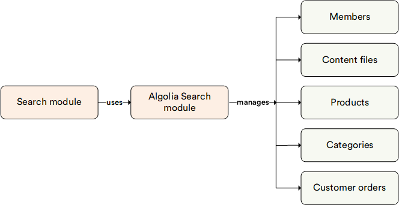

# Overview 

The **Algolia Search** module serves as a search engine within the Search module. It is renowned for its robust marketing capabilities and extensive personalization features, making it a valuable tool for enhancing user experience and driving engagement.

## Key features

The diagram below illustrates the functionality of the Algolia Search module:

 
 
********

    <a href="../../elastic-search/overview">← Elasticsearch module overview</a>
    <a href="../../lucene/overview">Lucene Search module overview →</a>

