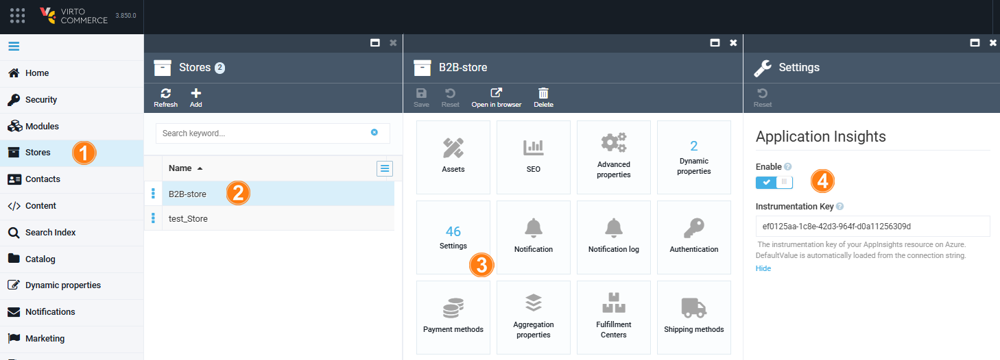

# Enable Application Insights

To enable the Application Insights feature:

1. Click **Stores** in the main menu.
1. In the next blade, select the desired store.
1. In the next blade, click on the **Settings** widget.
1. In the next blade, switch the **Application Insights** option to on. The instrumentation key is automatically loaded from the connection string. 

The Application Insights feature is now enabled, and metrics, application telemetry, and trace logging data will be collected in Microsoft Azure Application Insights.

 
 
********

    <a href="../overview">← Application Insights module overview</a>
    <a href="../../google-sso/overview">Google SSO module overview →</a>

