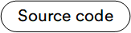

# Overview

The **Azure Application Insights** module enables the collection of key metrics, application telemetry, and trace logging data, providing deep insights into the performance and health of your application within Microsoft Azure.

{: style="display: block; margin: 0 auto;" }

## Key features

* Collects standard metrics.
* Collects application telemetry data.
* Collects application trace logging data.
* Offers flexible configuration through settings or code.
* Allows configuration of Application Insights settings, including specifying the **Instrumentation Key** for each store.

 
 
********

    <a href="../../ai-doc-processing/overview">← AI Doc Processing module overview</a>
    <a href="../enable-app-insights">Enabling Application Insights →</a>

