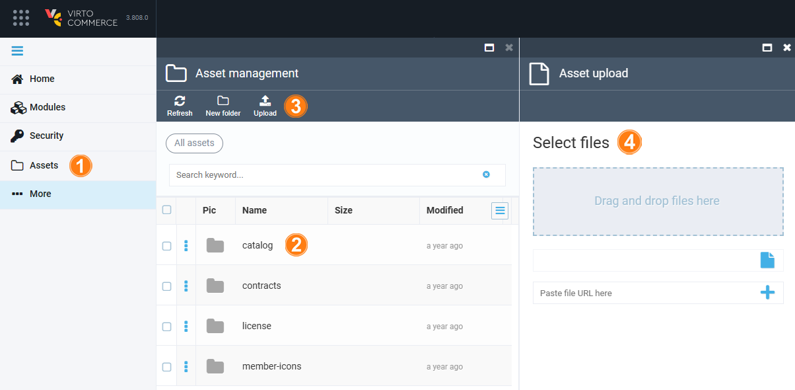
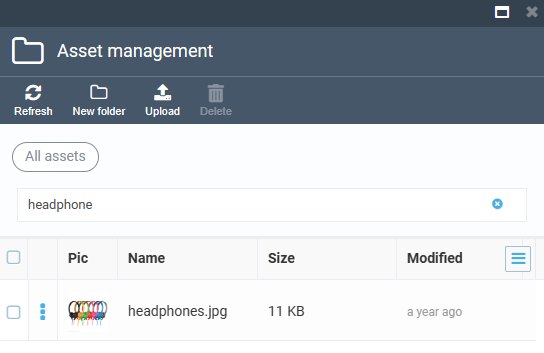

# Manage Assets

Managing assets includes:

* [Uploading files.](managing-assets.md#upload-files)
* [Organizing files.](managing-assets.md#organize-files)
* [Searching files.](managing-assets.md#search-files)

## Upload files

To upload a file:

1. Click **Assets** in the main menu.
1. In the next blade, select a folder you need to add your file to.

    !!! note
        You cannot upload files to the root. Selecting folder is required.

1. Click **Upload** in the toolbar.
1. In the next blade, upload your file by:
    * Dragging and dropping it to the specified area.
    * Browsing it from your computer.
    * Pasting the file URL to the specified field.

The uploading starts automatically.

## Organize files

For your convenience, the files are stored in folders. Choose either the existing folder, or create a new one by clicking **New folder** in the toolbar.

## Search files

To find a file, type its name in the search field and click <kbd>Enter</kbd>.

