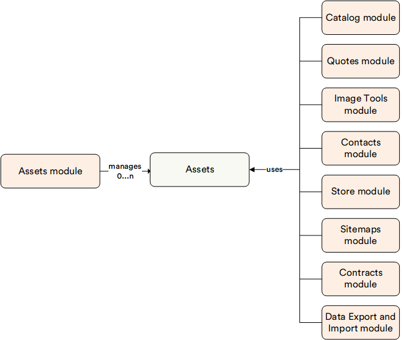

# Overview

The Virto Assets module is a base module that provides a powerful, flexible, and extensible asset management platform. With this module, you can easily search, organize, and retrieve assets stored in multiple locations, including file systems, Azure storage, and other custom asset storage solutions.

The module is designed to be highly configurable and extensible, allowing developers to easily add new asset storage providers or customize existing ones to meet the unique needs of their organization. It defines a set of common abstractions for searching, retrieving, and manipulating assets, making it easy for developers to work with assets regardless of their underlying storage location.

!!! note
    You cannot work directly with platform files; the only way to do so is through the Assets abstraction.

Virto Commerce includes the following out-of-the-box providers: 

* [**File System**](https://github.com/VirtoCommerce/vc-module-filesystem-assets): For storing files in the same directory as the Platform.
* [**Azure Blob Storage**](https://github.com/VirtoCommerce/vc-module-azureblob-assets): For storing files in the external storage, e.g. Azure blob storage.

{: width="25"} [Configuring assets providers](../../../developer-guide/Configuration-Reference/appsettingsjson)

## Key Features

The diagram below illustrates the Assets module functionality:

With the Assets module, you can:

* [Upload files.](managing-assets.md#upload-files)
* [Search files.](managing-assets.md#search-files)
* [Organize files.](managing-assets.md#organize-files)