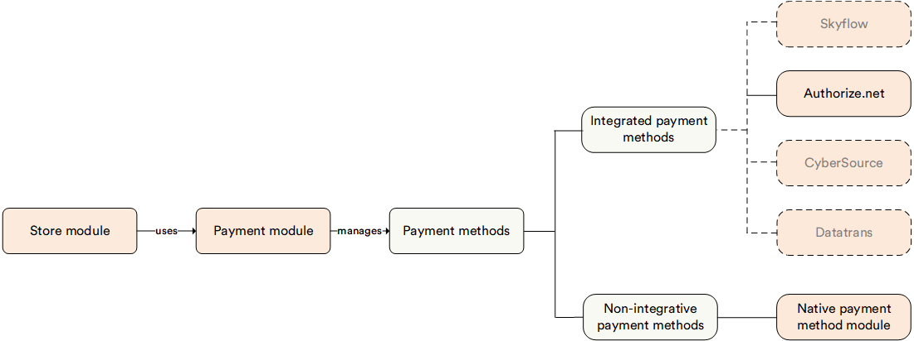

# Overview

The **Authorize.net** module provides seamless integration with Authorize.net using [Accept.js](https://developer.authorize.net/api/reference/features/acceptjs.html) and the [Authorize.net API](http://developer.authorize.net/api). This module enables secure payment processing by using the powerful features of Authorize.Net. It ensures a smooth transaction experience for both sellers and customers. 

## Key features

The Authorize.net module enables:

- **Secure payment processing**: Utilizes Accept.js to handle payment data securely, reducing the risk of PCI compliance issues.
- **Flexible integration**: Easily integrates with your existing ecommerce Platform, allowing for a smooth and efficient setup process.
- **Real-time transactions**: Provides real-time transaction processing and reporting, ensuring that you always have up-to-date information on your payments.
- **Comprehensive support**: Supports various payment methods including credit cards, electronic checks, and more, offering flexibility to your customers.
- **Enhanced security**: Incorporates advanced fraud detection tools and security measures to protect against fraudulent transactions.

The diagram below illustrates the interconnections among various key entities within the Authorize.Net module:

{: style="display: block; margin: 0 auto;" }

 
 
********

    <a href="../../native-payment-methods/overview">← Native payment methods overview</a>
    <a href="../manage-authorize-net-module">Managing Authorize.net →</a>

