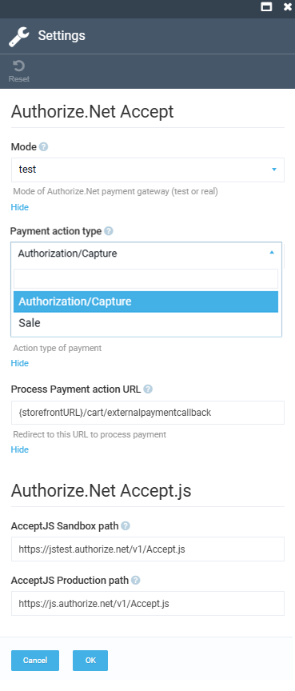

# Settings

To configure the module's settings:

1. Click **Settings** in the main menu.
1. In the next blade, type **Payment**, then select **Authorize.net**.
1. In the next blade, configure the following settings:

    {: style="display: block; margin: 0 auto;" }

1. Click **OK** to save the changes.

{: width="25"} [Configuring confidential information](../../../developer-guide/Fundamentals/Payments/authorize-net)

Your modifications have been saved.

 
 
********

    <a href="../overview">← Managing Authorize.net</a>
    <a href="../../cybersource/overview">CyberSource module overview →</a>

