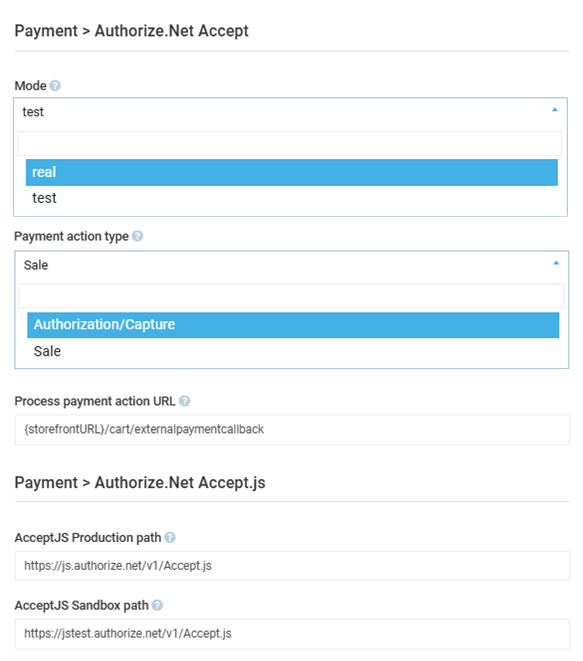

# Settings

To configure the module's settings:

1. Click **Stores** in the main menu. 
1. In the next blade, select your store.
1. In the next blade, click on the **Payment methods** widget.
1. In the next blade, select **Authorize.net**.
1. In the next blade, click on the **Settings** widget:
1. In the next blade, configure the following settings:

    {: style="display: block; margin: 0 auto;" }

1. Click **OK**, then **Save** to save the changes.

You modifications have been applied.

{: width="25"} [Configuring confidential information](/platform/developer-guide/latest/Fundamentals/Payments/authorize-net)

 
 
********

    <a href="../overview">← Managing Authorize.net</a>
    <a href="../../cybersource/overview">CyberSource module overview →</a>

