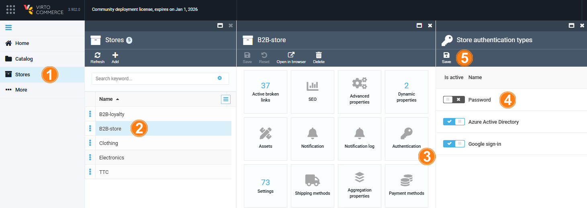

# Enable Authentication Types

To set an authentication type for your store:

1. Open **Stores** in the main menu.
1. In the next blade, select your store.
1. In the next blade, click on the **Authentication** widget.
1. Enable/ disable one or all available authentication types.
1. Click **Save** in the toolbar to save the changes.

The modifications have been successfully applied.

 
 
********

    <a href="../overview">← Azure AD module overview</a>
    <a href="../../back-in-stock/overview">Back-in-Stock module overview →</a>

