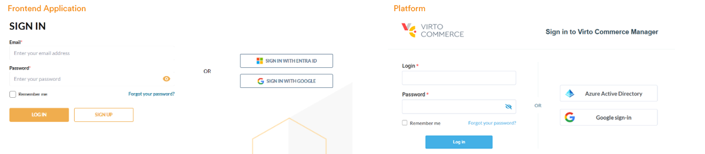

# Azure AD

The **Azure AD** module provides users with a simplified sign-in experience. It allows users to access multiple applications with a single set of credentials, eliminating the need to remember different usernames and passwords for each application.

The Azure AD module integrates Virto Commerce with Azure AD to provide secure authentication and authorization for cloud and on-premises applications. This helps to improve productivity, security, and user satisfaction by reducing the number of times users are prompted for their credentials.

## Key features

* The Azure AD module can be integrated with both the Virto Commerce Platform and the Frontend Application:

    {: style="display: block; margin: 0 auto;" }

* Supports single-tenant and multi-tenant configurations.

{: width="25"} [Using Azure AD as SSO provider in the Platform](../../../developer-guide/Fundamentals/Security/extensions/adding-azure-as-sso-provider)

{: width="25"} [Using Azure AD as SSO provider in the Frontend Application](../../../../storefront/developer-guide/authentication/adding-sso-provider)

 
 
********

    <a href="../../google-sso/overview">← Google SSO module overview</a>
    <a href="../enabling-authentication-types">Enabling authentication types →</a>

