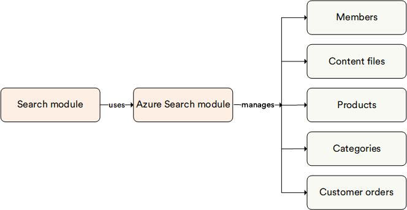

# Overview 

The **Azure Search** module serves as a search engine within the Search module. It is renowned for its seamless integration with Microsoft Azure services, simplified management interface, and scalability options tailored for Azure cloud environments.

## Key features

The diagram below illustrates the functionality of the Azure Search module:

