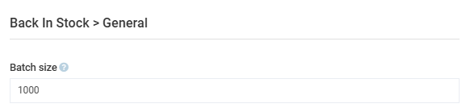
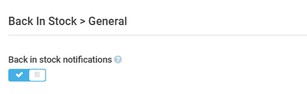

# Settings

To open the Back-in-Stock module general settings:

1. Click **Settings** in the main menu.
1. In the search field of the next blade, type **Back in stock** to find the settings related to the module or simply click on it in the list.
1. Click **General**.
1. Define the number of back in stock subscriptions to process per batch:

    {: style="display: block; margin: 0 auto;" }

1. Click **Save** in the toolbar to save the changes.

Your modifications have been applied.

 
 

To open store-specific module settings:

1. Open **Stores** from the main menu.
1. In the next blade, select  your store.
1. In the next blade, click on the **Settings** widget.
1. Find **Back-in-Stock** settings in the left panel and enable or disable back-in-stock notifications:

    {: style="display: block; margin: 0 auto;" }

1. Click **Save** in the toolbar to save the changes.

Your modifications have been applied.

 
 
********

    <a href="../stock-and-notifications-management">← Inventory and notifications management</a>
    <a href="../../catalog-csv-export-import/overview">Catalog CSV Export and Import module overview →</a>

