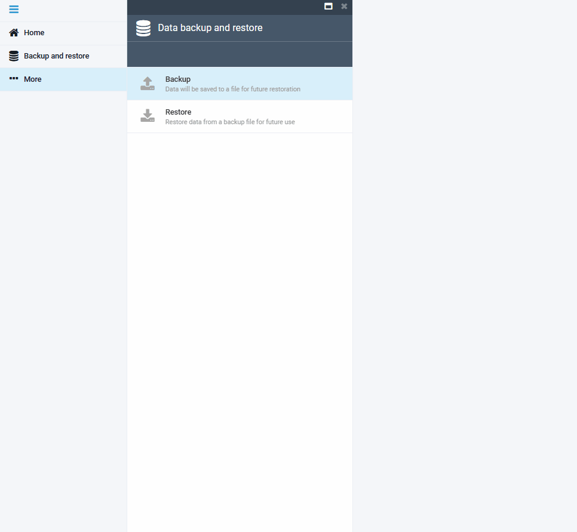
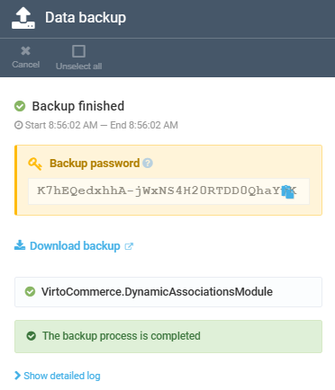
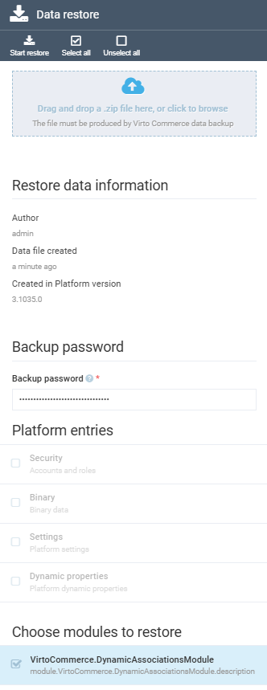
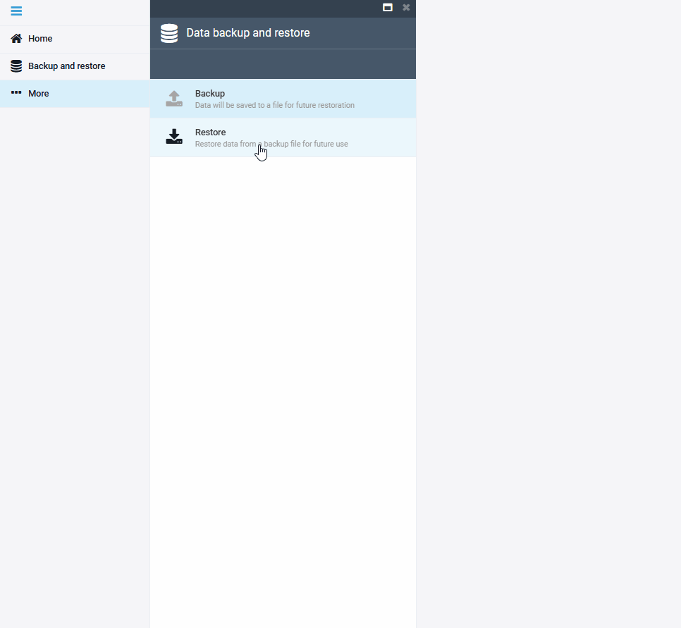

# Backup and Restore  

The **Backup and restore** feature in Virto Commerce allows you to securely export and restore Platform data, ensuring data safety and easy recovery when needed.  Backups can be encrypted with a one-time password (AES-256) so that sensitive information such as user credentials and API keys is protected at rest.

## Backup  

To create a backup of your data:  

1. Click **Backup and restore** in the main menu.  
1. In the **Data backup and restore** blade, click **Backup**.  
1. In the **Data backup** blade, check the data types you want to back up, such as security accounts, binary data, and more:

    | Platform entry         | Description                                                                                                                  | Notes|
    | ---------------------- | ---------------------------------------------------------------------------------------------------------------------------- | ---- |
    | **Password protect**   | Encrypt the backup with a one-time password (AES-256). Enabled by default and recommended for all backups that include sensitive data. | If you also disable **Password protect**, an additional red warning banner is displayed, alerting you that the backup will be unencrypted. |
    | **Security**           | Include accounts and roles.   | When you include **Security** in the backup, the blade displays a contextual warning banner above the Platform entries section, informing you that password hashes, API keys, and security stamps will be included in the backup file. |
    | **Binary**             | Include binary data.                                                                                                                   | |
    | **Settings**           | Include Platform settings.                                                                                                             | |
    | **Dynamic properties** | Include Platform dynamic properties.                                                                                                   | |

    !!! tip
        Keep **Password protect** enabled whenever the backup includes Security, Binary, or Settings entries. The one-time password is the only thing that stops a stolen backup file from being used to take over user accounts.

1. Check the modules you want to back up.
1. Click **Start export** in the toolbar. The backup process starts and a per-module progress timeline appears. Each module renders as a card showing its current state (in progress, completed, or failed) and the elapsed time. Use Show detailed log to reveal the full progress log and Copy log to copy it to the clipboard.

    {: style="display: block; margin: 0 auto;" width="700"}

1. When the backup finishes:

    * A green **Backup finished** banner is displayed.
    * A **Download backup** link appears. Click it to download the resulting ZIP file.
    * If password protection is enabled, the **Backup password** card displays the one-time password. Use the **Copy** button next to the password to copy it to the clipboard.

    !!! warning
        The backup password is shown only once on this screen. If you navigate away from the blade without copying it, the password cannot be recovered, and the backup file cannot be restored.

    {: style="display: block; margin: 0 auto;" }

You can now download a ZIP file containing your backup for future restoration.  

## Restore

To restore data from a backup:  

1. Click **Backup and restore** in the main menu.  
1. In the **Data backup and restore** blade, click **Restore**.  
1. In the **Data restore** blade, drag and drop your backup ZIP file into the designated area.  
1. The Platform reads the backup manifest and displays Restore data information (Author, Data file created, Created in Platform version).
1. If the backup is encrypted, a **Backup password** section appears. Enter the password that was shown when the backup was created.
1. Under **Platform entries** and **Choose modules to restore**, select the data types and modules you want to restore:

    {: style="display: block; margin: 0 auto;" }

1. Click **Start restore** in the toolbar.  

    {: style="display: block; margin: 0 auto;" width="700"}

The system will restore the data from the backup file.

### Incorrect password

If the password you enter does not match the one used when the backup was created, the restore is rejected by the Platform. The blade stays in the password entry state and displays a red message below the password field:

{: style="display: block; margin: 0 auto;" }

The password field is cleared so you can re-enter the value. No data is changed in the Platform.

### Restoring sensitive data

When you restore a backup with **Security** enabled, the blade displays a warning banner that explains the consequences:

```
This restore will overwrite sensitive data — User passwords, API keys, and security stamps from the backup will replace the current values for every user in the file.
Your own admin account (username) will not be modified — your password and active session are preserved.
```

The Platform automatically preserves the account of the administrator who initiated the restore. Your **PasswordHash**, **SecurityStamp**, **LockoutEnd**, and **AccessFailedCount** values stay unchanged, your active session is not invalidated, and the password you logged in with continues to work.

The detailed log includes a confirmation message for this skip:

```
User 'admin' skipped to preserve your active session — password and security stamp left unchanged.
```

!!! warning
    All other users in the backup file have their credentials replaced with the values stored in the backup. After the restore, they may need to use the password they had at the moment the backup was created.


<br>
<br>
********

<div style="display: flex; justify-content: space-between;">
    <a href="../view-results-on-frontend">← Viewing results on Frontend </a>
    <a href="../dynamic-properties/managing-dynamic-properties">Managing dynamic properties →</a>
</div>