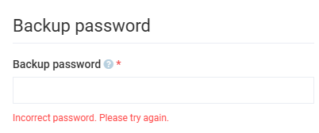

# Restore

To restore data from a backup:

1. Click **Backup and restore** in the main menu.
1. In the **Data backup and restore** blade, click **Restore**.
1. In the **Data restore** blade, drag and drop your backup ZIP file into the designated area.
1. The Platform reads the backup manifest and displays Restore data information (Author, Data file created, Created in Platform version).
1. If the backup is encrypted, a **Backup password** section appears. Enter the password that was shown when the backup was created.
1. Under **Platform entries** and **Choose modules to restore**, select the data types and modules you want to restore:

    {: style="display: block; margin: 0 auto;" }

1. Click **Start restore** in the toolbar.

    {: style="display: block; margin: 0 auto;" width="700"}

The system will restore the data from the backup file.

!!! note
    After a fully successful restore, the Platform automatically removes the backup file you uploaded for the restore. If the restore finishes with any errors, the file is kept so you can fix the issue and retry without uploading it again. The original backup file you downloaded when creating the backup is not affected.

## Incorrect password

If the password you enter does not match the one used when the backup was created, the restore is rejected by the Platform. The blade stays in the password entry state and displays a red message below the password field:

{: style="display: block; margin: 0 auto;" }

The password field is cleared so you can re-enter the value. No data is changed in the Platform.

## Restoring sensitive data

When you restore a backup with **Security** enabled, the blade displays a warning banner that explains the consequences:

```
This restore will overwrite sensitive data — User passwords, API keys, and security stamps from the backup will replace the current values for every user in the file.
Your own admin account (username) will not be modified — your password and active session are preserved.
```

The Platform automatically preserves the account of the administrator who initiated the restore. Your **PasswordHash**, **SecurityStamp**, **LockoutEnd**, and **AccessFailedCount** values stay unchanged, your active session is not invalidated, and the password you logged in with continues to work.

The detailed log includes a confirmation message for this skip:

```
User 'admin' skipped to preserve your active session — password and security stamp left unchanged.
```

!!! warning
    All other users in the backup file have their credentials replaced with the values stored in the backup. After the restore, they may need to use the password they had at the moment the backup was created.

<br>
<br>
********

<div style="display: flex; justify-content: space-between;">
    <a href="../backup">← Backup</a>
    <a href="../../catalog-csv-export-import/overview">Catalog CSV Export and Import module overview →</a>
</div>
