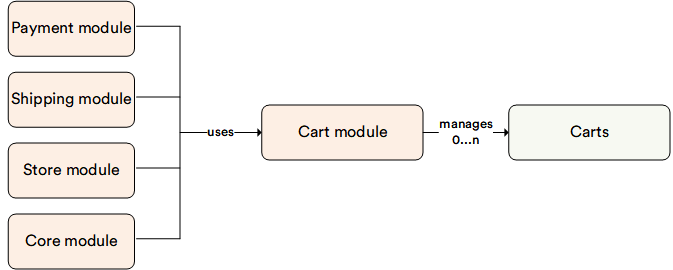

# Overview

The **Cart** module represents shopping cart management system. This module doesn't have any UI in VC Manager.

The Cart module:

* Manages customers' list of items.
* Calculates order total, including shipping/ handling charges and associated taxes.

## Key features

The Cart module offers:

* **Multiple carts**: Users can work with several carts simultaneously.
* **Named lists**: Creation of wishlists for later use in placing orders.
* **Grouping multiple carts**: Combine details from multiple carts into a final order.
* **Anonymous carts**: Option to submit orders without creating an account.
* **Stock reservation**: Products added to the cart are reserved in stock for checkout.
* **Multiple payment methods**: Flexibility to choose from various payment methods.
* **Cart creation from order history**: Convenient reordering from previous purchase history.
* **Soft delete**: Marking shopping carts as deleted without permanent removal.

The diagram below illustrates the Cart module functionality:

{: style="display: block; margin: 0 auto;" }

 
 
********

    <a href="../../contacts/overview">← Contacts module overview</a>
    <a href="../settings">Cart module settings →</a>

