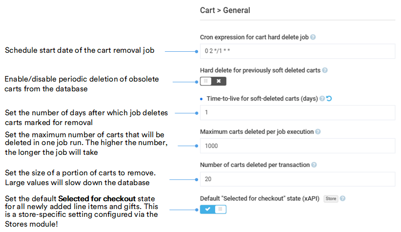
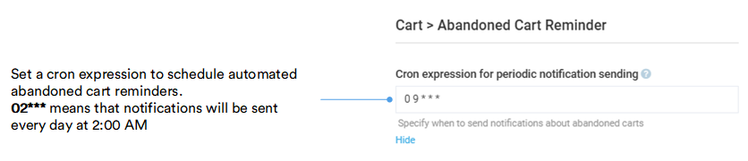
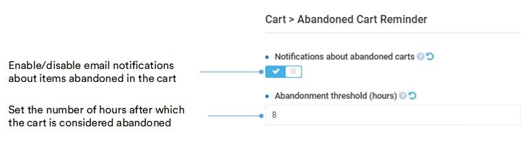

# Settings

Although the Cart module does not have a UI, you can configure:

* [General settings.](#general-settings)
* [Abandoned cart reminder.](#abandoned-cart-reminder)

## General settings

To open the Cart module general settings:

1. Click **Settings** in the main menu.
1. In the search field of the next blade, type **Cart** to find the settings related to the module.
1. Click **General** to configure the following settings:

    {: style="display: block; margin: 0 auto;" }

1. Click **Save** in the toolbar to save the changes.

Your modifications have been applied.

## Abandoned cart reminder

To configure the abandoned cart reminder globally:

1. Click **Settings** in the main menu.
1. In the search field of the next blade, type **Cart** to find the settings related to the module.
1. Click **General** to configure the cron expression for periodic notification sending:

    {: style="display: block; margin: 0 auto;" }

1. Click **Save** in the toolbar to save the changes.

Your modifications have been applied.

 
 
To configure store-specific reminders:

1. Open **Stores** from the main menu.
1. In the next blade, select  your store.
1. In the next blade, click on the **Settings** widget.
1. Find **Cart** settings in the left panel and configure the following:

    {: style="display: block; margin: 0 auto;" }

    !!! note
        The notification text is configured via the [Notifications module](../notifications/notification-templates.md).

1. Click **Save** in the toolbar to save the changes.

Your modifications have been applied.

 
 
********

    <a href="../overview">← Cart module overview</a>
    <a href="../../marketing/overview">Marketing module overview →</a>

