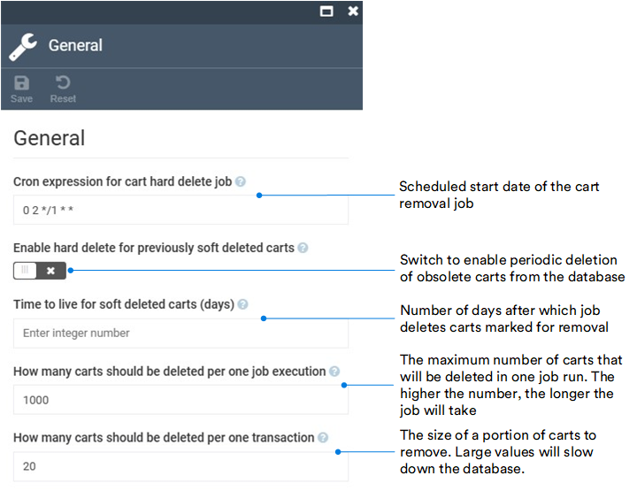

# Settings

Although the Cart module does not have a UI, you can configure its settings:

* Abandoned cart reminder.
* General settings.

To open the Cart module settings:

1. Click **Settings** in the main menu.
1. In the search field of the next blade, type **Cart** to find the settings related to the module.
1. Click **General** to configure the following settings:

    

1. Click **Abandoned cart reminder** to configure the following settings:

    

    !!! note
        The notification text is configured via the [Notifications module](../notifications/notification-templates.md).

1. Click **Save** in the toolbar to save the changes.

The settings have been saved.

 
 
********

    <a href="../overview">← Cart module overview</a>
    <a href="../../marketing/overview">Marketing module overview →</a>

