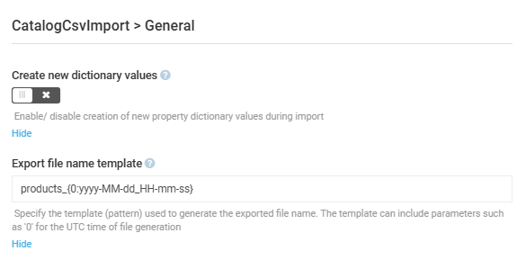

# Settings

To configure the settings of the **Catalog CSV Import** module:

1. Click **Settings** in the main menu.
1. In the next blade, type **CSV** to find settings related to the module.
1. Click **General**.
1. In the next blade:

    {: style="display: block; margin: 0 auto;" }

1. Click **Save** in the top toolbar to save the changes.

Your modifications have been applied.

 
 
********

    <a href="../export-catalog">← Exporting catalog</a>
    <a href="../../catalog-personalization/overview">Catalog Personalization module overview→</a>

