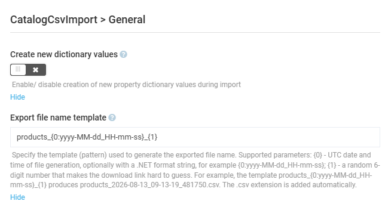

# Settings

To configure the settings of the **Catalog CSV Import** module:

1. Click **Settings** in the main menu.
1. In the next blade, type **CSV** to find settings related to the module.
1. Click **General**.
1. In the next blade:

    {: style="display: block; margin: 0 auto;" }

1. Click **Save** in the toolbar to save the changes.

Your modifications have been applied.

## Export file name template

The **Export file name template** field controls the file name of a generated catalog export. The shipped default is:

```
products_{0:yyyy-MM-dd_HH-mm-ss}_{1}
```

The template supports the following parameters:

| Parameter | Description |
| --- | --- |
| `{0}` | UTC date and time of generation, with an optional .NET format string such as `{0:yyyy-MM-dd_HH-mm-ss}`. |
| `{1}` | Random 6-digit number. |

The `.csv` extension is appended automatically. Do not include it in the template. A blank template falls back to the default. A template without `{1}` keeps producing the same names it produced before the upgrade.

!!! note "Upgrade note"
	A value already saved for this setting overrides the new default. The file name does not change until you clear the field or add `{1}` manually. Clearing the field restores the default.


<br>
<br>
********

<div style="display: flex; justify-content: space-between;">
    <a href="../export-catalog">← Exporting catalog</a>
    <a href="../../catalog-personalization/overview">Catalog Personalization module overview→</a>
</div>