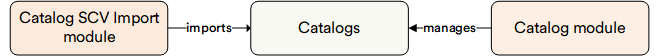

# Overview

The Catalog CSV Import Module is required to import catalogs in CSV format. 

## Key Features

The diagram below illustrates the interconnections between the Catalog CSV Import module and the Catalog module:

{: width="25"} [Importing Catalog](../catalog/import-catalog.md)
