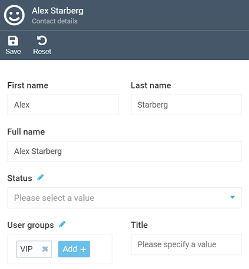
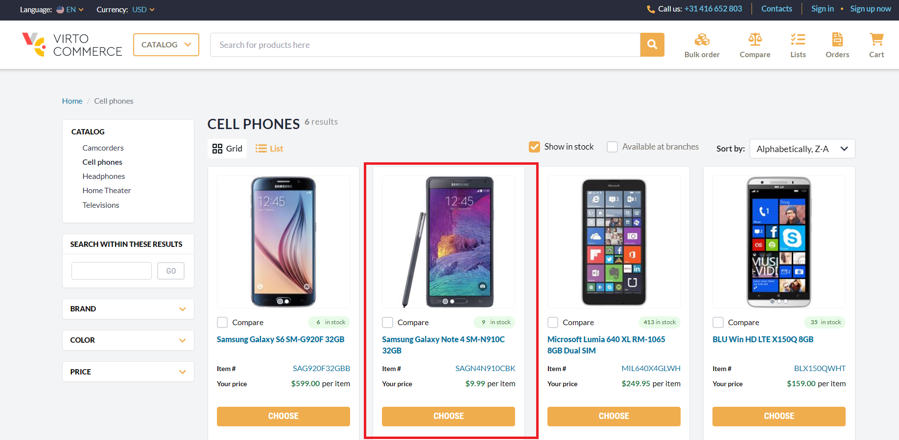
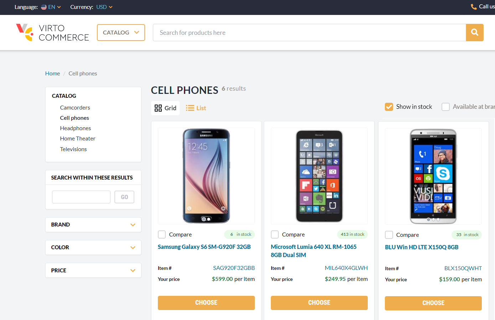
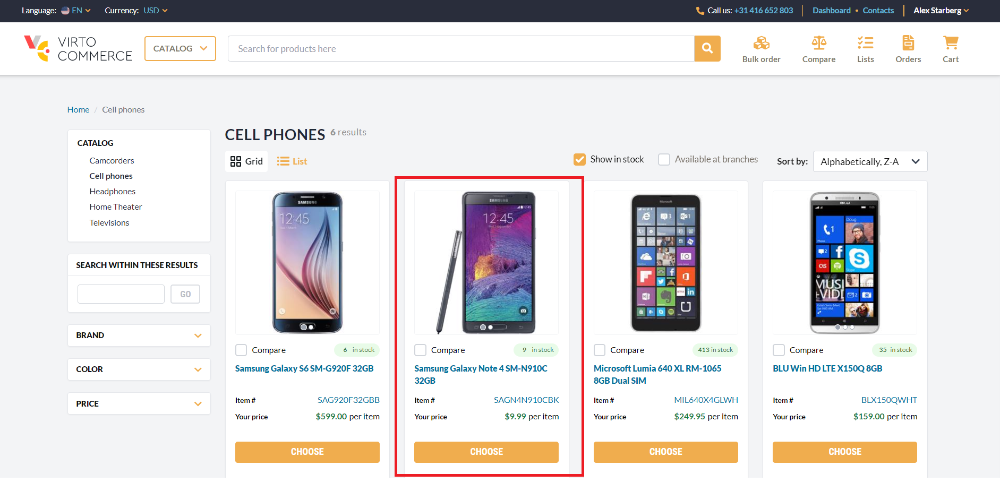

# Show Catalog Items for Specific Users

In this example, we will configure Virto Platform to make an item available for viewing and purchase exclusively to selected customers. Let's assume you have an item you want to sell only to your loyal customers as a reward for their loyalty.

1. [Create a user group](user-groups.md#add-new-user-group).
1. [Add all required contacts to this group](../contacts/managing-contacts.md#add-contacts). You can easily create as many contacts as needed. In our example, we have created a group called **VIP** and assigned various contacts to it, including Alex Starberg, who will be our loyal customer in the example:

	

1. By default, the item you wish to sell only to loyal customers (Samsung smartphone in our example) is visible to anyone who visits the store:

	{: width="600"}

	To limit the access and allow only our **VIP** customers to see it, [assign the **VIP** group to the product or category](user-groups.md#assign-user-groups-to-product) in question.

1. Rebuild the index so that our changes may come into effect.

Now, if someone who is not included in our VIP group visits our store, they won't see the item in question:

{: width="600"}

However, once Alex Starberg, our loyal customer, logs into the store, he will immediately have the option to purchase it:

{: width="600"}

{: width="25"} [Enabling special prices for specific users](../pricing/example.md)

 
 
********

    <a href="../user-groups">← Managing user groups</a>
    <a href="../settings">Settings →</a>

