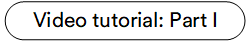
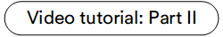

# Overview

The Virto Commerce Catalog Personalization is designed to personalize the online shopping experience for customers by showing them tailored product recommendations, content, or offers via the user groups feature.

The **User groups** feature allows you to associate specific user groups with a product or category. This association can determine which user groups have access to view or interact with the products within that category.

## Key features

* [Assigning user groups to products.](user-groups.md#assign-user-groups-to-product)
* [Assigning user groups to categories.](user-groups.md#assign-user-groups-to-category)
* [Managing personal prices.](../pricing/adding-new-assignment.md)
