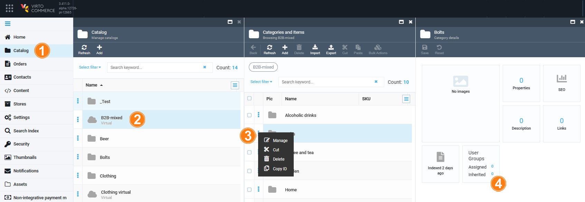
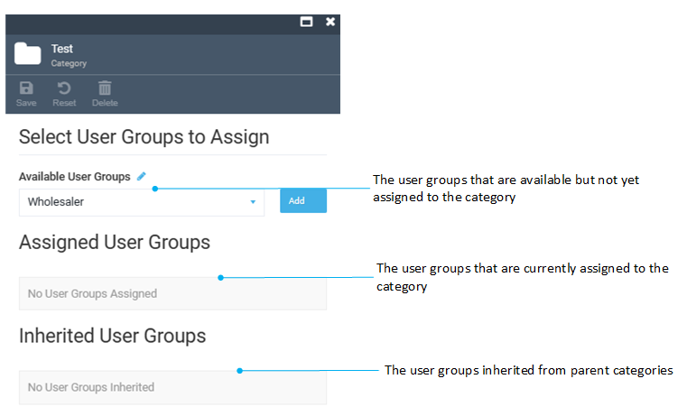
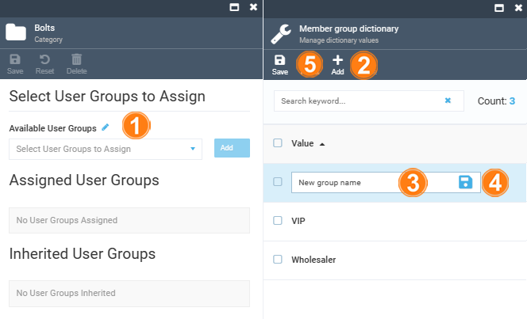
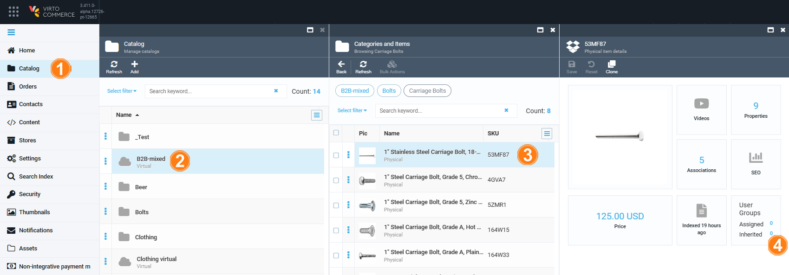

# Manage User Groups

The user groups within a Catalog module can be assigned to:

* [Categories.](user-groups.md#assign-user-groups-to-category) 
* [Products.](user-groups.md#assign-user-groups-to-product)

{: width="25"} [Assigning user groups to price lists](../pricing/adding-new-assignment.md)

!!! note
	All category products inherit the user group if the [DownTree propagation](settings.md) is enabled.

## Assign user groups to category

To assign user groups to a category:  

1. Click **Catalog** in the main menu.
1. In the next **Manage catalogs** blade, select the required catalog.
1. In the next **Categories and items** blade, click three dots to the left of the category name, then click **Manage** in the popup menu. 
1. In the next **Category details** blade, click on the **User Groups** widget.

	{: style="display: block; margin: 0 auto;" }

1. In the next blade, fill in the fields. Click **Add** to assign the available user groups from a drop-down list.

    {: style="display: block; margin: 0 auto;" }

1. Click **Save** in the toolbar to save the changes. 

The user group has been assigned to the category.

### Add new user group

To add a new user group:

1. In the **Category** blade (see step 5 above), click {: width="20"} next to the **Available User Groups** field to open the **Member group dictionary** blade.
1. Click **Add** in the toolbar.
1. Type the name of the new user group type.
1. Click {: width="20"}. 
1. Click **Save** in the toolbar to save the changes.

{: style="display: block; margin: 0 auto;" width="550"}

Your new user group has been created.

## Assign user groups to product

To assign user groups to a product:

1. Click **Catalog** in the main menu.
1. In the next **Manage catalogs** blade, select the required catalog.
1. In the next **Categories and items** blade, click the required product.
1. In the next **Physical items details** blade, click on the **User Groups** widget.

	{: style="display: block; margin: 0 auto;" }

1. In the next blade, fill in the fields. Click **Add** to assign the available user groups from a drop-down list.

    {: style="display: block; margin: 0 auto;" }

1. Click **Save** in the toolbar to save the changes. 

The user group has been assigned to the product.

!!! warning
	Rebuild the search indexes for categories and products after assigning user groups:

	{: style="display: block; margin: 0 auto;" width="550"}

 
 
********

    <a href="../overview">← Catalog personalization module overview</a>
    <a href="../example">Showing catalog items for specific users →</a>

