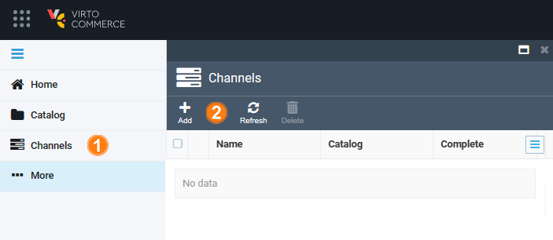
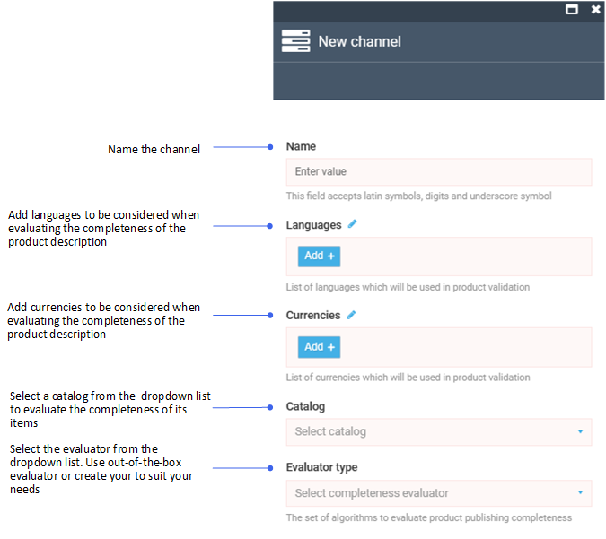
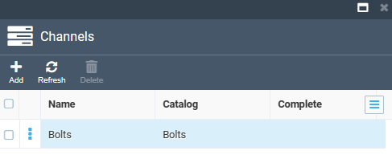
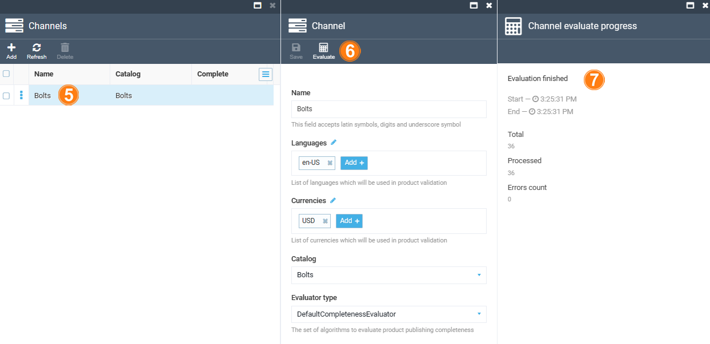
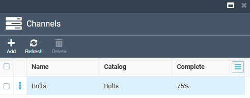
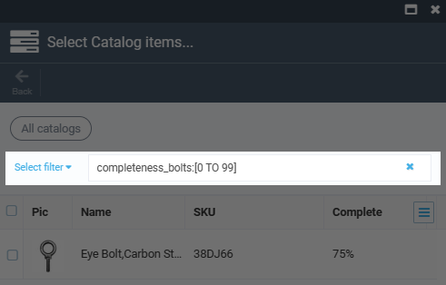
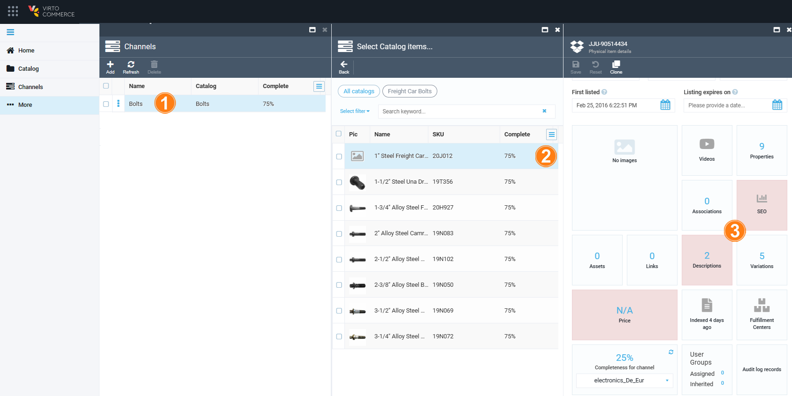

# Evaluate Product Description Completeness

With the Catalog Publishing module you can:

* [Create channels to view the product description completeness.](managing-channels.md#create-channel)
* [View missing description segments for each product.](managing-channels.md#view-missing-descriptions)

## Create channel

To evaluate the completeness of a catalog description create a **channel** as follows:

1. Click **Channels** in the main menu.
1. In the next blade, click **Add** in the toolbar to create a new channel.

    

1. In the next blade, fill in the following fields:

    
     
     
    {: width="25"} [Configuring products completeness evaluator](../../../developer-guide/Extensibility/product-completeness-evaluator)
     
     
1. Click **Create** to save the changes. The channel will appear in the **Channels** blade.

    

1. Select the created channel from the list. 

1. In the next blade, click **Evaluate** in the toolbar to start the evaluation. 
1. You will see the result in the next blade.

    

1. Click **Refresh** in the **Channels** blade to see the result of the evaluation. 

In our case, the completeness of the **Bolts** catalog equals 75%.

## View missing descriptions

To see what is missing in the product descriptions:

1. Select a channel from the list.
1. In the next blade, you will see the list or products in the evaluated catalog, each showing its description completeness. Select the desired item.

    !!! note
        You may need to click the cross in the filters field to remove the filters and see full results list.

        

1. In the next blade, the reddish background indicates the widgets with incomplete information. 

    

Click on the reddish widgets to complete the descriptions from the current location. 

 
 
********

    <a href="../overview">← Catalog Publishing module overview</a>
    <a href="../../contracts/overview">Contracts module overview →</a>

