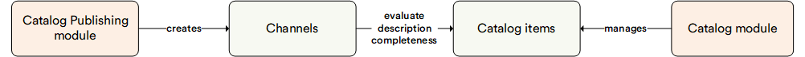

# Overview

The Catalog Publishing Module is a set of tools for evaluating the completeness of products for publication according to specified criteria.

## Key Features

The diagram below illustrates the interconnections between the Catalog and the Catalog Publishing module:

