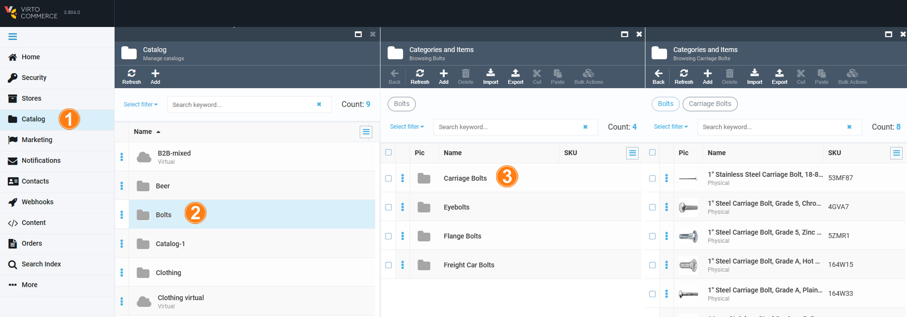
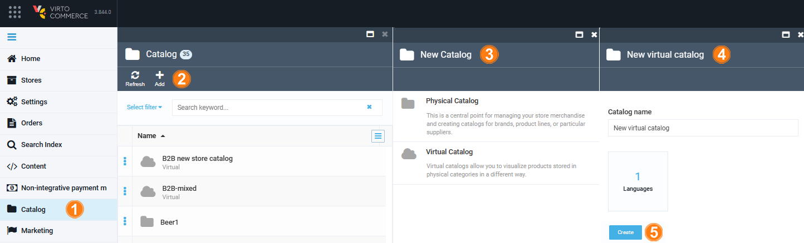

# Manage Catalogs

Virto Commerce supports two types of catalogs:

* [Physical catalogs.](add-new-catalog.md#physical-catalogs)
* [Virtual catalogs.](add-new-catalog.md#virtual-catalogs)

You can readily differentiate physical catalogs from virtual ones through their respective folder or cloud icons. Additionally, virtual catalogs will include the **Virtual** suffix in their names.

!!! note
	Fulfillment centers are relevant to physical products only. If a store sells digital content, such as software or music, it does not need such centers.

## Physical Catalogs

A physical catalog is an online inventory of products or services that a company presents. These products can be categorized, where each product may belong to a single category or can directly belong to a catalog without being associated with any specific category.

!!! note
	You can assign only one physical catalog to a store.

## Virtual Catalogs

Virtual catalogs are created on the basis of one or more physical catalogs. A virtual catalog serves as a platform to showcase goods, technically representing a collection of diverse items selected from various physical catalogs.

Every virtual catalog requires a unique name not shared by other virtual or physical catalogs. While virtual catalogs consist of products and categories found in physical catalogs, it's not possible to include products from one virtual catalog in another virtual catalog.

Basically, a virtual catalog is a method to visually present products. All items are situated in physical catalogs, which is why they are referred to as such. This also implies that any changes made to an item in a physical catalog will be immediately reflected in the associated virtual catalogs.

### View Catalogs

To view a catalog:

1. Click on the **Catalog** module in the main menu.
1. In the next **Manage catalogs** blade, select the desired catalog.
1. In the next **Categories and Items** blade, select a desired category, or search for the desired product by keyword.

	

Now you see the list of products in the catalog.

### Add New Catalog

To add a new catalog:

1. Click on the **Catalog** module in the main menu.
1. In the next **Manage catalogs** blade, click **Add** in the toolbar.  
1. In the **New catalog** blade, choose the catalog type: physical or virtual.
1. In the next blade, enter the catalog's name and specify the language.
1. Click **Create** to save the changes.

	

Your catalog is ready to use!

