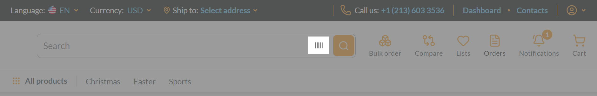
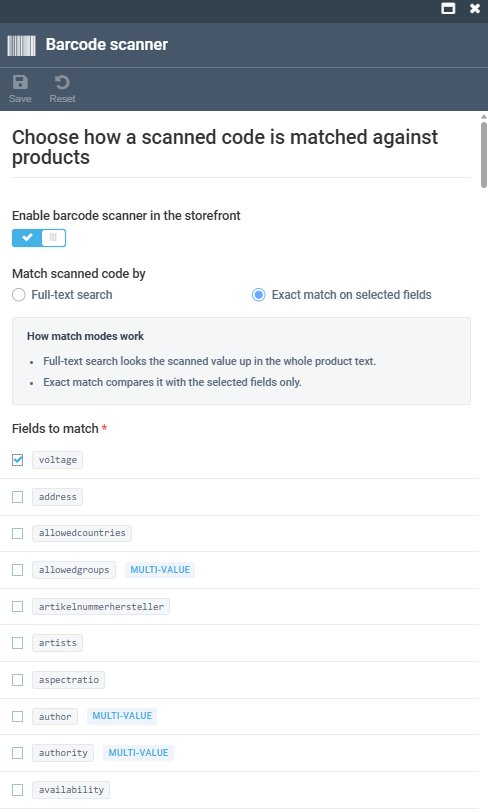

# Configure Barcode Scanner Search

Barcode scanner search lets Frontend shoppers scan a barcode and find the matching product, by comparing the scanned value against one or more product properties you choose.

{: width="20"} [Barcode scanner. Frontend](/storefront/user-guide/latest/shopping/searching-for-products#barcode-scanner)

Configuring barcode scanner search includes:

* [Enabling barcode scanner on the Frontend.](#enable-barcode-scanner-on-the-frontend)
* [Selecting barcode scanner search mode.](#configure-barcode-scanner-search-mode)

## Enable barcode scanner on the Frontend
To enable the barcode scanner:

1. Click **Stores** in the main menu.
1. In the next blade, select your store.
1. Click the **Settings** widget.
1. Type **Barcode** to find the settings related to the feature. 
1. Turn the **Barcode scanner** option to on.
1. Click **OK**, then **Save**.

On the Frontend, the barcode scanner icon is added to the search bar:

## Configure barcode scanner search mode

To configure how a scanned code is matched to a product:

1. Click **Stores** in the main menu.
1. In the next blade, select your store.
1. Click the **Search configuration** widget.
1. In the next blade, click the **Barcode scanner** widget.
1. In the next blade, you can switch between the following search modes:

    * **Full-text search** treats a scan as an regular keyword search.
    * **Exact match on selected fields** matches the scanned value only against the fields you specify, such as address, SKU, or GTIN.

    {: style="display: block; margin: 0 auto;" }

1. Click **Save** in the toolbar to save the changes.

Barcode scanner search is now configured for the store.

!!! note
    If no property is selected, a scanned barcode matches nothing.

 
 
********

    <a href="../managing-properties">← Managing properties</a>
    <a href="../managing-SEO">Managing SEO →</a>

