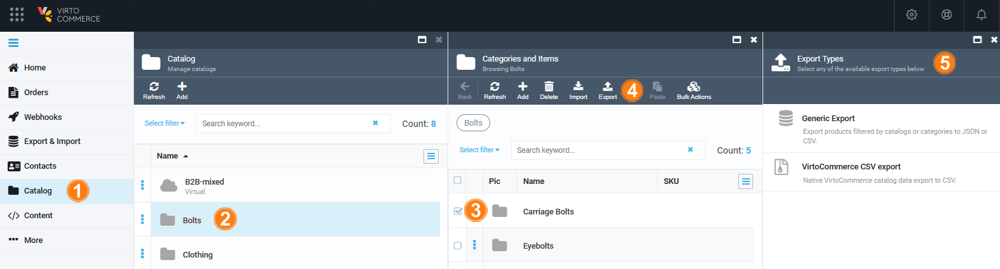

# Export Catalog

With the Virto Commerce export feature, users can efficiently extract and save catalog data for the following purposes:

* Backup and recovery.
* Data sharing.
* Offline analysis. 
* Migration and integration.
* Customization and localization.

!!! note
    Exporting catalogs requires preinstalled [Generic Export module](../generic-export/overview.md).

To export catalog:

1. Click **Catalog** in the main menu.
1. In the next blade, select the required catalog.
1. In the next blade, check the categories and items to export.
1. Click **Export** in the top toolbar.
1. In the next blade, select:
    * **Generic Export** to [export products filtered by catalogs or categories to JSON or CSV](../generic-export/exporting-data.md).
    * **VirtoCommerce CSV Export** to export data to CSV using native VirtoCommerce feature.

    

1. Fill in the required fields according to the instructions.
1. Click the download URL after the export is complete.

The exported catalog has been downloaded.