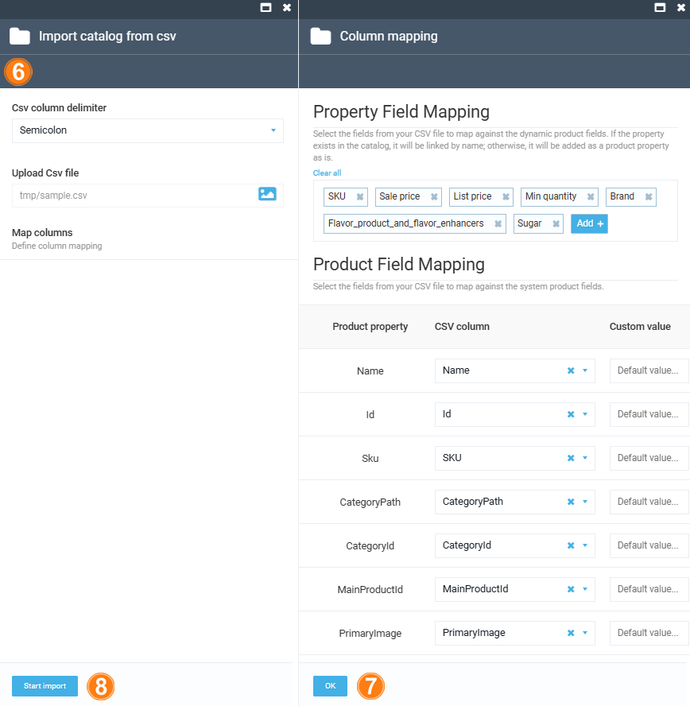

# Import Catalog

With the Virto Commerce Import Catalog module, users can import their catalogs in CSV format.

!!! note
    Importing catalogs requires preinstalled [Catalog CSV Import module](../catalog-csv-import/overview.md).

To import your catalog in CSV format:

1. Click **Catalog** in the main menu.
1. In the next blade, click on the required catalog.
1. If required, select a subcatalog to import new items into.

    !!! note
        If you import new products from a file without specifying either the category id or the category path, the default is the root directory - the catalog.

1. Click **Import** in the top toolbar.
1. In the next blade, click **VirtoCommerce CSV import**.

    

1. In the next blade: 
    1. Select **Semicolon** as a delimeter from the dropdown list.
    1. Upload your CSV file.
    1. Click **Map columns**.
1. In the next blade, customize the mapping of your product properties to the default properties defined in the application, ensuring they are appropriately stored in the database. Click **OK**.
1. In the **Import catalog from csv** blade, click **Start import**.

{: width="600"}

The catalog has been imported.