# Import Products, Prices, and Stock Quantities to Catalog via CSV File

To efficiently bulk add new products, along with their prices and stock quantities at each fulfillment center, you can use the CSV file import option.

!!! note
    Importing products to catalogs requires the preinstalled [Catalog CSV Import module](https://github.com/VirtoCommerce/vc-module-catalog-csv-import).

Follow this step-by-step guide to learn how to import new products into the Virto Commerce Platform catalog (backend) and display them on the Virto Commerce Frontend Application:

1. [Create a new price list](../pricing/creating-new-price-list.md). **New-price-list** in our example.
1. Copy the Id of the created price list to clipboard. **c801f074-b9d3-4662-8978-845c8b0d75ca** in our example.

    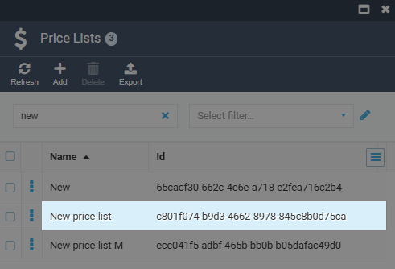{: style="display: block; margin: 0 auto;" }

1. Create a CSV file containing all the necessary fields, i.e., product name, Id, SKU, price, price list Id, etc. To create a new catalog, you can [export a catalog in a CSV format](export-catalog.md) or [download this sample file](price-list-sample.xlsx) to use as a template.

    !!! tip 
        Add a **CategoryPath** field to specify the product's separate category in a catalog. 
        Provide **Quantity** and **FulfillmentCenterId** fields to specify a quantity at a specific fulfillment center. 
        Fill the **PrimaryImage** field with links to images to provide a product's image.

1. Paste the copied price list Id to the **PriceListId** field.

    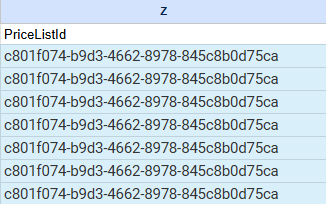{: style="display: block; margin: 0 auto;" }

1. [Create a new catalog](add-new-catalog.md#add-new-catalog) (**New_catalog** in our example) and [add a new category](managing-categories.md#add-new-category) into it (**New_category** in our example).

    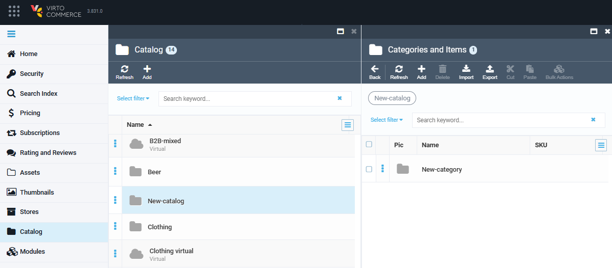{: style="display: block; margin: 0 auto;" }

1. Fill the catalog with information by [importing your CSV file into it](import-catalog.md).

    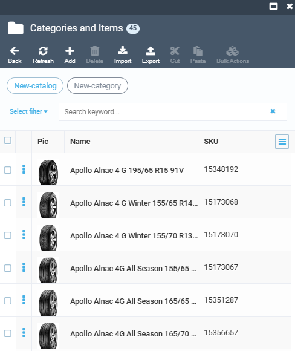{: style="display: block; margin: 0 auto;" }

1. Link your catalog to the catalog of the store. As long as the store displays only one catalog, linking new catalogs to the one displayed is the best way to extend the displayed assortment:

    1. In the main menu, click **Catalog**.
    1. In the next blade, select the required **Catalog**. **B2B-mixed** in our example.
    1. In the next blade, click **Add** in the top toolbar.
    1. In the next blade, select **Link**.
    1. In the next blade, select the newly created catalog. **New-catalog** in our example.

        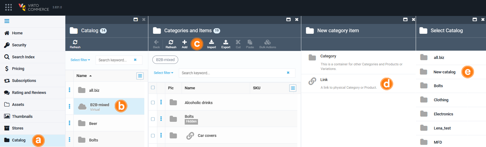

    1. In the next blade, check the category. **New-category** in our example.
    1. Click **Map** in the top toolbar.

        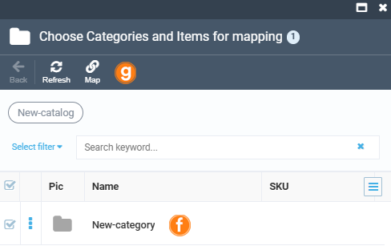{: style="display: block; margin: 0 auto;" }

    In the **Categories and Items** blade, you will see that the required category has been linked to the catalog:

    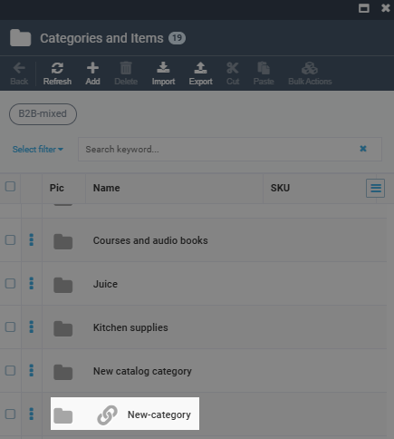{: style="display: block; margin: 0 auto;" }

1. Create a price list assignment to connect the price list (**New-price-list** in our example) to the catalog displayed in the Frontend Application (**B2B-mixed** in our example):

    1. In the main menu, click **Pricing**.
    1. In the next blade, click **Price Lists**.
    1. In the next blade, select the required price list (**New-price-list** in our example).
    1. In the next blade, click on the **Assignments** widget. 
    1. In the next blade, click **Add** in the top toolbar.

        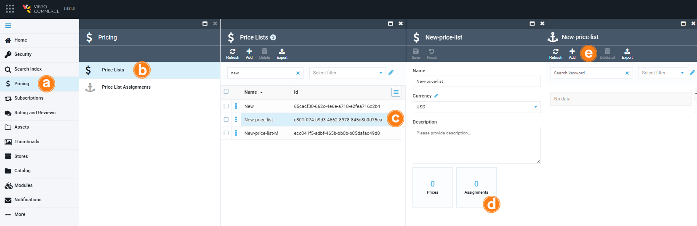

    1. In the next blade, fill in at least the following fields:
        
        1. Specify the assignment name.
        1. Select a price list from the dropdown list (**New-price-list** in our example).
        1. Select a catalog from the dropdown list (**B2B-mixed** in our example).
        1. Click **Create**.

        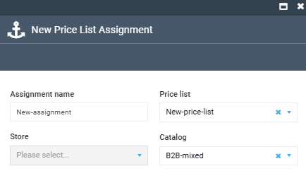{: style="display: block; margin: 0 auto;" }

    Your new assignment appears:

    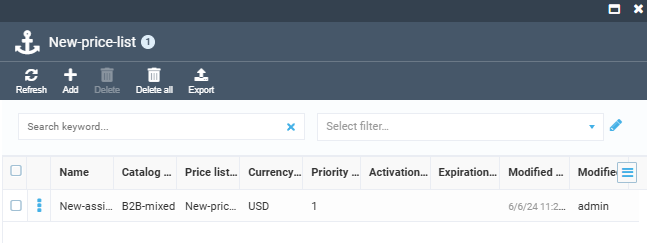{: style="display: block; margin: 0 auto;" }

1. Fill the price list with the items from your newly created catalog:
    1. Click on the **Prices** widget.
    1. In the next blade, click **Add** in the top toolbar.
    1. In the next blade, select the required catalog (**New-catalog** in our example.)
    1. In the next blade, select the category (**New-category** in our example).
    1. In the next blade, check the items to add to the price list. 
    1. Click **Add selected** in the top toolbar. You might need to repeat it several times if the items are located on more the one page.

        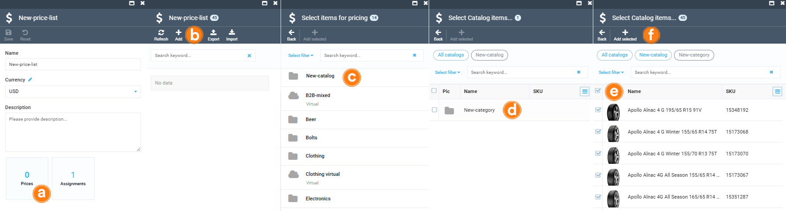{: style="display: block; margin: 0 auto;" }

1. Check SEO Settings of your catalog (**Catalog --> Your catalog (New-catalog) --> New category --> SEO widget --> Your category (New-category)**). Make sure your catalog has a unique URL slug and is assigned to the proper store:

    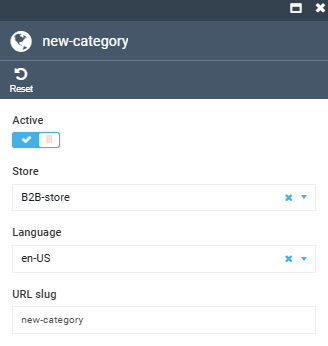{: style="display: block; margin: 0 auto;" }

1. View the results in the Frontend environment:

    1. In the main menu, click **Stores**.
    1. In the next blade, click on the required store (**B2B-Store** in our example).
    1. In the next blade, click **Open in browser** in the top toolbar.

        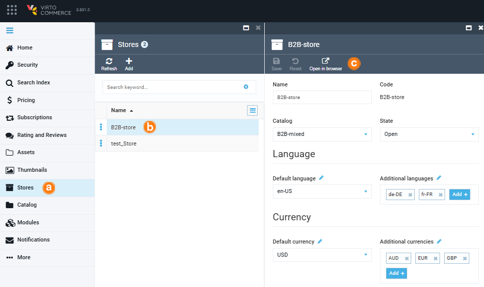{: style="display: block; margin: 0 auto;" width="750"}

    The frontend environment opens in a new window with the **/new-category** URL slug. The image below shows what it looks like and how it correlates to the columns in the CSV file:

    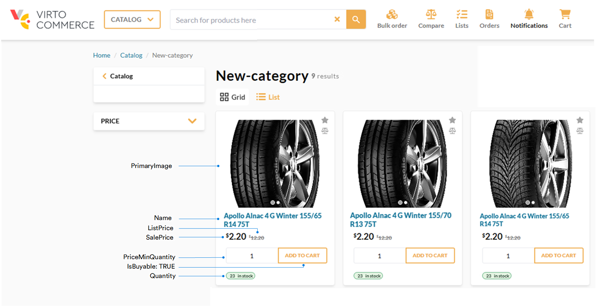

## Update products

When updating an existing product through CSV import, you must provide either the **Id** or the **SKU**:

* If a product with the specified **Id** or **SKU** exists, its properties will be updated.
* If no matching product is found, a new product will be created. In this case, the **Name** field becomes required.

### Update specific properties

To update a few properties of a product without changing the others:

1. Identify the product with either **Id** or **SKU**.
1. Include only the fields you want to update in the CSV file — all other properties will remain unchanged.
1. Import the updated CSV file back into the system.

The specified properties have been updated.

### Update SEO data

If you need to update SEO information after the initial product import, Virto Commerce supports this workflow through the CSV import mechanism. As of version [3.811.0](https://github.com/VirtoCommerce/vc-module-catalog-csv-export-import/releases/tag/3.811.0), reimporting SEO fields updates the existing entry instead of creating a new one.

To update SEO information via CSV:

1. Keep the **SeoId** value unchanged.
1. Modify any of the other SEO fields (e.g., SeoUrl, SeoTitle, SeoDescription, SeoLanguage, etc.) directly in the CSV file.
1. Import the updated CSV file back into the system.

After the import, the existing SEO information will be updated accordingly.

 
 
********

    <a href="../import-catalog">← Importing catalogs</a>
    <a href="../export-catalog">Exporting catalogs →</a>

