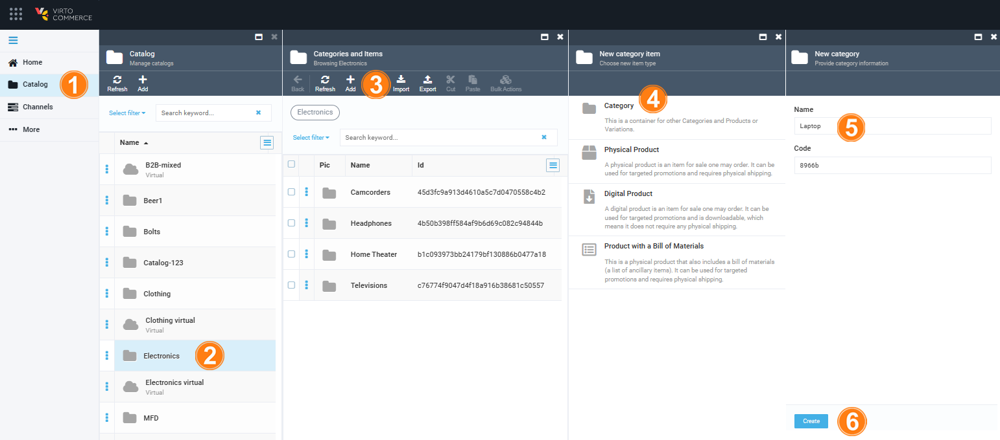
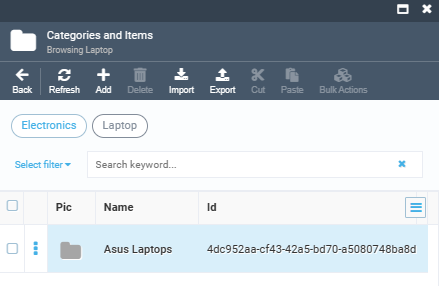
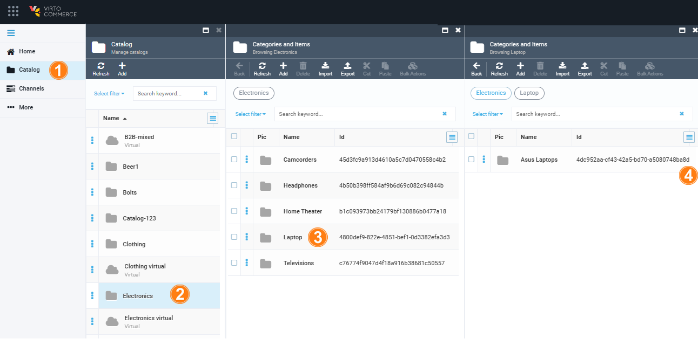
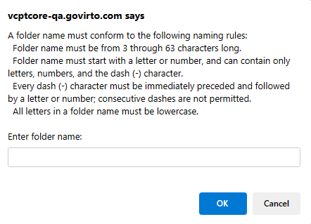
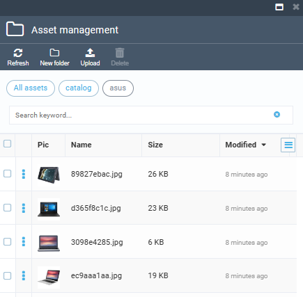
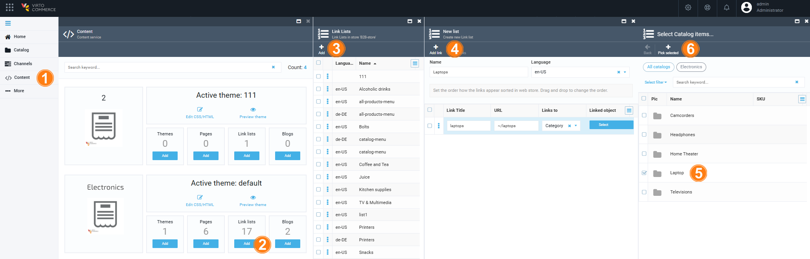

# Import Products to VС Catalog [In Progress]

Learn how to import new products into the Virto Commerce Platform (backend) catalog and view them on the Virto Commerce Storefront (frontend) with ease.

## Prerequisites

Before starting the import process:

* [Install Virto Commerce Platform (backend) and Virto Commerce Storefront (frontend)](../../Getting-Started/Installation-Guide/windows.md).
* Install [Catalog CSV Import module](https://github.com/VirtoCommerce/vc-module-catalog-csv-import).
* Download the [electronics-new-products-example.csv](electronics-new-products-example.csv) file of new products or [export a file from the Catalog module of Virto Commerce Platform](export-catalog.md) to use as a template.
* Download the [images-example.zip](images-example.zip) file and extract its contents, which include 15 images of new products.
* Install Microsoft Excel or any other .csv file editor.

## Create Catalog Data File in .CSV Format

Prepare a .csv file with your product data similar to the downloaded **electronics-new-products-example.csv**. Follow these steps:

1. In Microsoft Excel, select the product properties needed from the list and fill in the corresponding columns as per our document. Set the PrimaryImage column values to URLs pointing to your product images in the Assets.
1. In LibreOffice, create a table with columns corresponding to the properties of your products. Fill in the table with the required data. For the delimiter, select a comma.
1. Save the file in .csv format.

## Create New Catalog/ Use Existing Catalog

Open Virto Commerce Platform and decide whether you want to add new products to:

=== "New catalog"

    To create a new category in the catalog, for example **Electronics**:

    1. In the main menu of Virto Commerce Platform, click **Catalog**.
    1. In the next blade, select the **Electronics** catalog.
    1. In the **Categories and Items** blade, click **Add** in the top toolbar. 
    1. In the **New category item** blade, click **Category**.
    1. In the **New category** blade, fill in the category name, such as **Laptops**.
    1. Click **Create** to save the changes.

        

    1. Click on the newly created **Laptops** category, then click **Add** in the top toolbar to create a subcategory, such as **Asus-Laptops**.
    1. Later, you will need the Id of the **Asus laptops** category. You can find it in the **Categories and items** blade.

        

=== "Existing catalog"

    To use the existing catalog:

    1. In the main menu of Virto Commerce Platform, click **Catalog**.
    1. In the next blade, select the required catalog, for example **Electronics**.
    1. In the next blade, select the required category, for example **Laptops**.
    1. In the next blade, copy the id of the required category to use in your .csv file.

    

## Upload Images For New Products

To add images for products: 

1. In the main menu, click **Assets**.
1. In the next **Assets management** blade, click **Catalog**.
1. In the next blade, click **New folder** in the top toolbar to create new folder, for example **asus**.

    !!! note
        Follow the following rules when creating a new folder:

        

1. Open your newly created folder and click **Upload** in the tooolbar.
1. In the next **Asset upload** blade, upload the images. In our case, previously extracted sample images from **images-example.zip**.

The images have been succesfully uploaded:

## Import and Map Catalog Data into Virto Commerce

To import your catalog in .csv format:

1. Go to **Catalog --> Electronics --> Laptops --> Asus Laptops**.
1. Click **Import** in the top toolbar.
1. In the next blade, click **VirtoCommerce CSV import**. 
1. In the next blade: 
    1. Select **Semicolon** as a delimeter from the dropdown list.
    1. Upload your .csv file.
    1. Click **Map columns**.
1. In the next blade, customize the mapping of your product properties to the default properties defined in the application, ensuring they are appropriately stored in the database. Click **OK**.
1. In the **Import catalog from csv** blade, click **Start import**.

!!! note
    If you import new products from a file without specifying either the category id or the category path, the default is the root directory - the catalog.

## Open New Products in Virto Commerce Platform (backend)

To see and edit all new products, go to **Catalog --> Electronics --> Laptops --> Asus Laptops**.

## Create New Menu Item in Virto Commerce Storefront (frontend)

To add a new category to Virto Commerce Storefront menu:

1. Open Virto Commerce Platform and click **Content** in the main menu.
1. Find the **Electronics** store and click on the **Link lists** widget.
1. In the next blade, click **Add** in the top toolbar.
1. In the next blade, fill in the following fields:
    * Name: **Laptops** in our example.
    * Language: **en-US**.
    * Link Title: **laptops**.  
    * URL: **~/laptops**.
    * Links to: select **Category** from the dropdown list.
    * Link object: click **Select**.
1. In the next blade, check the required folder.
1. In the top toolbar, click **Pick selected**.

    

1. Click **Create** to save the changes. 

A new category has been added to the menu.

To add a new subcategory:

1. Click on the newly created item, **Laptops** in our case.
1. In the next blade, click **Add link** in the toolbar.
1. Fill in the following fields:
    * Name: **Asus Laptops** in our example.
    * Language: **en-US**.
    * Link Title: **laptops**.  
    * URL: **~/laptops/asus-laptops**.
    * Links to: select **Category** from the dropdown list.
    * Link object: click **Select**.
1. In the next blade, check the required folder.
1. In the top toolbar, click **Pick selected**.

A new subcategory has been added to the menu.

{: width="25"} [Manage Linklists](../../../../user-guide/content/managing-linklists)

## Create Thumbnails for New Product Images

{: width="25"} [Create Thumbnails](../../../../user-guide/thumbnails/generating-thumbnails)

## Build Search Indexes

{: width="25"} [Build Search Index](../../../../user-guide/catalog/managing-search-index)

## Open new products in Virto Commerce Storefront

Now you can see new menu item **Laptops**, new subitem **Asus Laptops**, and all new products in Virto Commerce Storefront.

{: width="25"} [Manage Properties](../../../../user-guide/catalog/managing-properties)