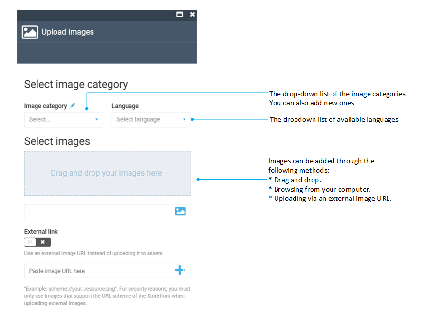

# Manage Categories

A category is basically a container for other categories, subcategories, or products.

Categories enable building hierarchies and links between various items in the catalog, which helps the customers navigate to the items they would like to purchase.

If you have large catalogs containing many items, you might want to create multiple categories and subcategories using the parent-child structure.

## Add new category

To add a new category to the catalog:

1. Click **Catalog** in the main menu.
1. In the next **Manage catalogs** blade, select the required catalog.
1. In the next **Categories and Items** blade, click **Add** in the toolbar.
1. In the **New category item** blade, select **Category**.

    !!! tip
        In this step, you can copy the current URL and paste it into a new window to open the desired category immediately.  

1. Fill in the category name. The code is generated automatically.

    {: style="display: block; margin: 0 auto;" }

1. Click **Create** to open the category details.
1. Fill in the Category details. 

    {: style="display: block; margin: 0 auto;" }

1. Click **Save**. 

Your new category appears in the **Categories** list.

### Tax type

!!! info
	You can add as many tax types as needed. 

To add a tax type:

1. In the **Category details blade**, click {: width="20"} next to the **Tax type** field to open the **Tax types** blade.
1. Click **Add** in the toolbar.
1. Type the name of the tax type and click {: width="20"}. 
1. Click **Save** in the toolbar to save the changes.

Your new tax type is displayed in the **Tax type** dropdown list.

### Images

To add images to a category:

1. In the **Category details** blade, click the **Images** widget to open the **Manage Images** blade.
1. Click **Add** to open the **Upload Images** blade.
1. Fill in the fields.

    {: style="display: block; margin: 0 auto;" }

1. Click **OK** to save the changes.

Your image(s) have been saved. 

### SEO 

To add a new SEO block:

1. In the **Category details** blade, click the **SEO** widget to open the **Manage SEO** blade.
1. Click **Add** to open the **SEO details** blade.
    
    {: style="display: block; margin: 0 auto;" }
 
1. Fill in the fields and click **OK**. 

Your new SEO block has been added to the SEO list.  

### Links

To link categories to the catalog items:

1. In the **Category details** blade, click the **Links** widget to open the **Links** blade.
1. Click **Add** to open the **Select catalog items...** blade.
1. Select the desired item (in the example, a virtual catalog from a list of virtual catalogs). You can not select the current category (if it is in the list), categories labelled as Marked, or category links within virtual catalogs.
1. Click **Confirm** to save the changes.

    {: style="display: block; margin: 0 auto;" }

The links to the current category within the selected virtual catalogs and categories have been created.

{: width="25"} [Properties widget](managing-properties.md)

{: width="25"} [User Groups widget](../catalog-personalization/user-groups.md)

 
 
********

    <a href="../export-catalog">← Exporting catalogs</a>
    <a href="../product-management-overview">Products management options →</a>

