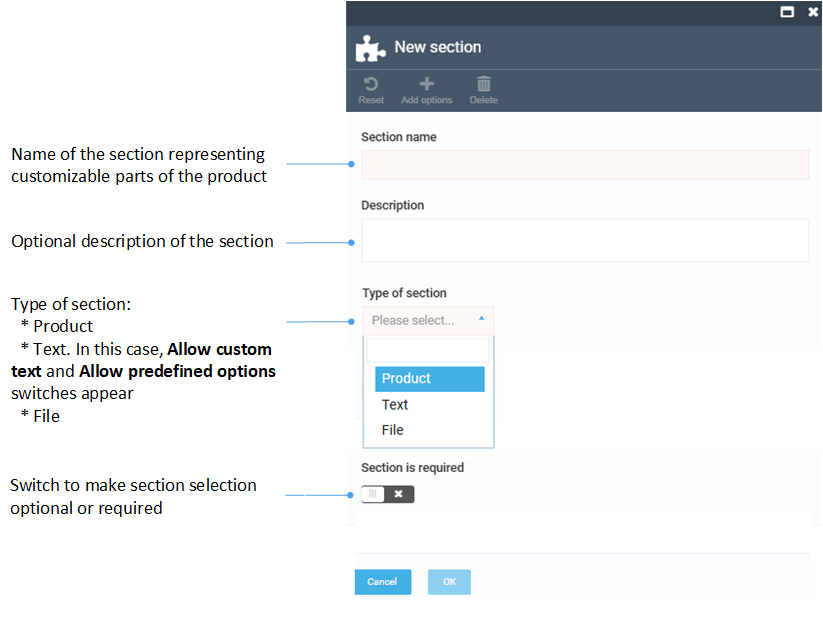
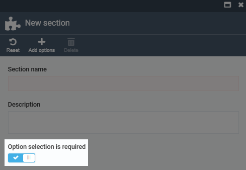

# Manage product configurations  

With the new configurable product feature, you can offer products that adapt to your customers' unique needs by allowing them to choose from available options. In Virto Commerce, we call customizable parts of the product **sections**, and the choices for each part of the product **options**. To make a product configurable:  

1. [Enable the configuration feature for the product.](#enable-configuration-feature)  
1. [Define sections and options.](#add-sections-and-options)  

## Enable configuration feature

To enable the configuration feature for any product:

1. Click **Catalog** in the main menu.
1. In the next blade, select the catalog with the product you want to make configurable.
1. In the next blade, select your product.
1. In the next blade, click on the **Configuration** widget.
1. In the **Product configuration** blade, switch the configuration option to on.

Now, you can add configurations to your product.

## Add sections and options

Let's add sections, each representing customizable parts of the product, and options, representing the choices for each part of the product. As an example, let's add the following:

<table border="1">
  <thead>
    <tr>
      <th>Section</th>
      <th>Options</th>
    </tr>
  </thead>
  <tbody>
    <tr>
      <td>Layers</td>
      <td>
        <ul>
          <li>Top: White / Bottom: White</li>
          <li>Top: Chocolate / Bottom: White</li>
          <li>Top: Chocolate / Bottom: Chocolate</li>
        </ul>
      </td>
    </tr>
    <tr>
      <td>Filling</td>
      <td>
        <ul>
          <li>Lemon tea</li>
          <li>Apple crumble</li>
          <li>Strawberry</li>
        </ul>
      </td>
    </tr>
    <tr>
      <td>Decoration</td>
      <td>
        <ul>
          <li>Lily</li>
          <li>Flowers</li>
        </ul>
      </td>
    </tr>
  </tbody>
</table>

!!! note
    Options are selected from existing catalog items, so ensure they are [added to a catalog](managing-products.md#add-product) before assigning them to sections.  

To add sections and options:

1. In the **Product configuration** blade, click **Add section** in the toolbar.
1. Fill in the following fields:

    

1. Click **Add options** in the toolbar.
1. In the **Select catalog items** blade, check the items to be added as options from the existing catalog:

    

    * To make an option required, switch this option to on in the section description blade:
    
        
    
        This ensures that users must select one of the available options when configuring the product on the Frontend:

        

    * If you switch this option to off, a **None** option automatically appears in the list on the Frontend. This allows users to skip selecting an option for that section when configuring their product:

        

1. Click **Confirm** in the toolbar.
1. Your options appear in the options list of the previous blade. Click **OK** to save the changes.
1. Repeat these steps to add all the required sections and options. The sections appear in the **Product configuration** blade:

    

    !!! note
        Drag and drop the sections to configure the order of their appearance in the Frontend Application.

1. Click **Save** in the toolbar to save the changes.

In the Frontend Application, you can identify configurable products by the **Customize** button instead of the **Add to cart** button:

The added sections appear under the product description:

