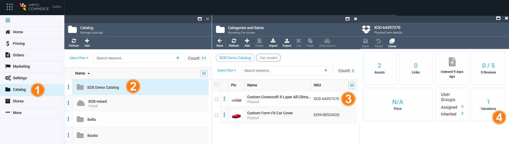
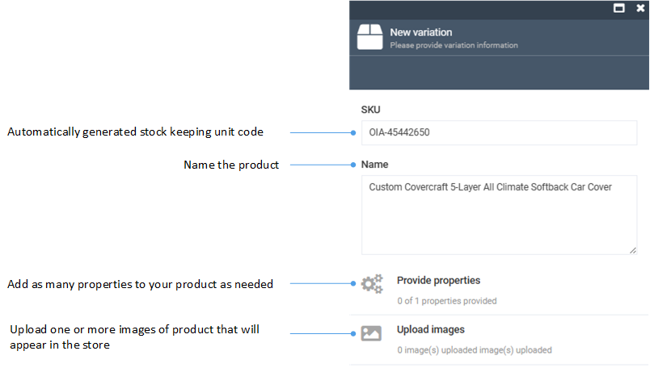

# Manage Product Variations

In Virto Commerce, we define products as SKUs. Adding variations links a product and its variation(s) together. A product with variations is essentially a collection, with one variation as the title product (master product), while also being a variation itself. Linked products inherit property values from the master product, with the option to override if needed.

To display a product with variations in the Frontend Application, we use the master product, along with its variations. The product description also draws from the master product's properties. Variation properties build the SKU selector for such products.

Variations are individual product entities linked to their master product. For instance, a master product like a mobile phone can have variations like black, white, or red versions, or 5’’ and 6’’ models (or both).
Variations inherit property values from the master product, including descriptions and assets, while also allowing overrides when necessary.

## Add product variation

To add a new variation to a product:

1. Click **Catalog** in the main menu.
1. In the next blade, select the required catalog to open the **Categories and items** blade.
1. Click the product you need to add variations to.
1. In the next **Physical item details**, click the **Variations** widget. 

    {: style="display: block; margin: 0 auto;" }

1. In the next blade, click **Add** in the toolbar to open the **New variation** blade.
1. Fill in the following fields:

    {: style="display: block; margin: 0 auto;" }

1. Click **Create** to save the changes.

The new variation is displayed in the **Item variations** list.

## View product variations

To view  product variations:

1. Follow steps 1-4 from the instruction above.
1. The product variations previously added to this particular product are displayed in the **Variations** blade. 

{: style="display: block; margin: 0 auto;" }

## Asset inheritance

A created product variation automatically inherits all assets and their properties from a parent product. Any subsequent updates to the parent product assets are reflected in the variation assets. After the user edits or adds a new asset to the variation product, inheritance stops automatically, the system makes a copy of the parent assets and adds them to the variation so that changes to the parent assets are no longer reflected in the **Variations**.

## Variations representation options

There are two options to display product variations on the Frontend:

* As a widget below the product description. Users add to cart the specific variation of a product that best fits their requirements:

    {: style="display: block; margin: 0 auto;" }

* As a selector as a part of product description. Customers click on individual option values (e.g., color, size, material) to configure their desired product. Once a customer selects an option, the remaining options are refreshed to reflect what’s available based on that selection. Unavailable combinations are visibly disabled. When only one value is available for a specific option, it is automatically selected:

    

Below is the guide how to switch between these two options.

### Displaying variations as selector

By default, variations are displayed on the Frontend as a list or as a table in a separate widget. To display product variations as a selector instead:

1. Click **Catalog** in the main menu to open the list of available catalogs.
1. Find the catalog containing the product and its variations you want to display as a selector and click on the three dots to the left of the catalog's name.
1. Select **Manage** from the dropdown menu. 
1. In the next blade, click on the **Properties** widget.
1. In the next blade, click **Add property** in the toolbar.
1. In the next blade, select **Product property**.
1. In the next blade, enter **VirtoFrontend_UI_Layout** as a property name.
1. Click **Save** in the toolbar.

    The new product property appears in the product properties list.

1. Open the catalog containing the product and its variations. 
1. Click on the required product.
1. In the next blade, click on the **Properties** widget.
1. Set the value of the **VirtoFrontend_UI_Layout** property to **B2C**.
1. Click **OK**.
1. Click **Save** in the toolbar.

On the Frontend, the product variations are now displayed as a selector.

Try our interactive demo to explore this setting in action:

  
  

    <iframe loading="lazy" class="sl-demo" src="https://virtocommerce.storylane.io/demo/4bbenx7mfwny?embed=inline" name="sl-embed" allow="fullscreen" allowfullscreen style="position:absolute;top:0;left:0;width:100%!important;height:100%!important;border:1px solid rgba(63,95,172,0.35);box-shadow: 0px 0px 18px rgba(26, 19, 72, 0.15);border-radius:10px;box-sizing:border-box;"></iframe>
  

### B2C product variation setup guidelines

* **One value per variation property**: Each variation should have just one value for each variation property (for example, one **Size** and one **Color**). Don’t put more than one value for the same property in a single variation - shoppers can only pick one value per property, and if a variation has **Size: L and XL**, the system can’t tell which one to use.

    | Good examples                             | Bad examples                                                          |
    | ----------------------------------------- | --------------------------------------------------------------------- |
    | T-shirt variation: Size = L, Color = Red  | T-shirt variation: Size = L and XL                                    |
    | Shoes variation: Size = 42, Color = Black | Jacket variation: Color = “Blue / Navy” (two colors in one variation) |

* **Use the same variation properties for every variation**: Choose the set of variation properties for the product (e.g., **Size** and **Color**) and use those same properties for all variations. Keep property names the same everywhere - the store shows a single set of properties to the shopper, and if some variations are missing a property or use a different name, the selection becomes confusing or impossible to finish.

    | Good examples                                   | Bad examples                                                       |
    | ----------------------------------------------- | ------------------------------------------------------------------ |
    | All T-shirt variations have both Size and Color | Some T-shirt variations have Size and Color; others only have Size |
    | All Sofa variations have Width and Fabric       | Mixing names: Color on some variations and Colour on others        |

 
* **Each combination must point to exactly one variation**: Any set of chosen values (e.g., **Size: L** + **Color: Red**) should match ONLY ONE variation. Don’t create two variations with the same full set of values - after a shopper makes their choices, the system must find exactly one item to buy, and if two variations share the same values, the result is unclear.

    | Good examples                          | Bad examples                                                       |
    | -------------------------------------- | ------------------------------------------------------------------ |
    | Size: M + Color: Blue exists only once | Two variations with Size: M + Color: Red                           |
    | Every Size/Color pair is unique        | Copies where only the SKU differs but the properties are identical |

 
* **Make sure the product is actually selectable**: If your product has more than one variation, you must add at least one variation property (like **Size** or **Color**) so shoppers can choose. If the product has only one variation, either add a simple one‑value property (e.g., **Size: One Size**) so it auto‑selects, or allow buying without variations. The system can finish the selection only when it can match one specific variation. With multiple variations and no properties, shoppers can’t choose which one; with zero properties, the system won’t produce a final selection.

    | Good examples                                                              | Bad examples                                                   |
    | -------------------------------------------------------------------------- | -------------------------------------------------------------- |
    | Hoodie with multiple variations has Size and Color                         | Product has 3 variations but no variation properties to select |
    | Single-variation belt with Size: One Size (auto-selected) or no variations |                                                                |

 
#### Quick checklist

* One value per variation property.
* Same variation properties on every variation.
* No duplicate value combinations.
* Multi‑variation products: at least one variation property. Single‑variation products: auto‑select or better prefer non variation product.

 
 
********

    <a href="../managing-products">← Managing products</a>
    <a href="../managing-product-configurations">Managing product configurations →</a>

