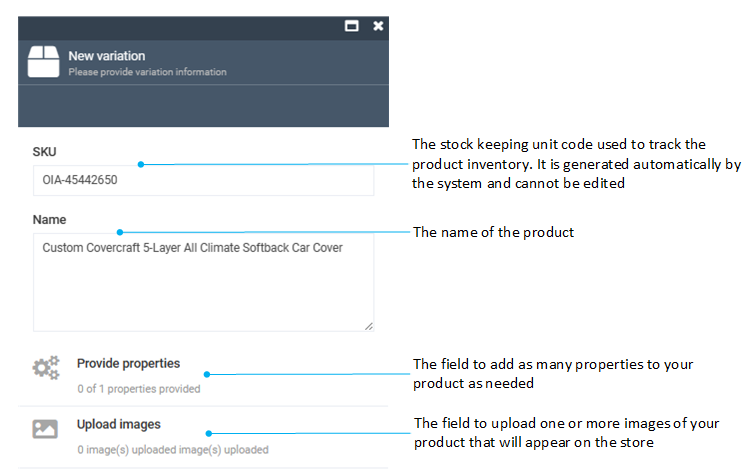

# Manage Product Variations

In Virto Commerce, we define products as SKUs. Adding variations links a product and its variation(s) together. A product with variations is essentially a collection, with one variation as the title product (master product), while also being a variation itself. Linked products inherit property values from the master product, with the option to override if needed.

To display a product with variations in the Frontend Application, we use the master product, along with its variations. The product description also draws from the master product's properties. Variation properties build the SKU selector for such products.

Variations are individual product entities linked to their master product. For instance, a master product like a mobile phone can have variations like black, white, or red versions, or 5’’ and 6’’ models (or both).
Variations inherit property values from the master product, including descriptions and assets, while also allowing overrides when necessary.

## Add product variation

To add a new variation to a product:

1. Click **Catalog** in the main menu.
1. In the next blade, select the required catalog to open the **Categories and items** blade.
1. Click the product you need to add variations to.
1. In the next **Physical item details**, click the **Variations** widget. 

    {: style="display: block; margin: 0 auto;" }

1. In the next blade, click **Add** in the toolbar to open the **New variation** blade.
1. Fill in the following fields:

    {: style="display: block; margin: 0 auto;" }

1. Click **Create** to save the changes.

The new variation is displayed in the **Item variations** list.

## View product variations

To view  product variations:

1. Follow steps 1-4 from the instruction above.
1. The product variations previously added to this particular product are displayed in the **Variations** blade. 

{: style="display: block; margin: 0 auto;" }

## Asset inheritance

A created product variation automatically inherits all assets and their properties from a parent product. Any subsequent updates to the parent product assets are reflected in the variation assets. After the user edits or adds a new asset to the variation product, inheritance stops automatically, the system makes a copy of the parent assets and adds them to the variation so that changes to the parent assets are no longer reflected in the **Variations**.

## Variations representation options

There are two options to display product variations on the Frontend:

* As a widget below the product description. Users add to cart the specific variation of a product that best fits their requirements:

    {: style="display: block; margin: 0 auto;" }

* As a selector as a part of product description (as of Frontend version [2.27.0](https://github.com/VirtoCommerce/vc-frontend/releases/tag/2.27.0)). Customers click on individual option values (e.g., color, size, material) to configure their desired product. Once a customer selects an option, the remaining options are refreshed to reflect what’s available based on that selection. Unavailable combinations are visibly disabled. When only one value is available for a specific option, it is automatically selected:

    

Below is the guide how to switch between these two options.

### Displaying variations as selector

By default, variations are displayed on the Frontend as a list or as a table in a separate widget. To display product variations as a selector instead:

1. Click **Catalog** in the main menu to open the list of available catalogs.
1. Find the catalog containing the product and its variations you want to display as a selector and click on the three dots to the left of the catalog's name.
1. Select **Manage** from the dropdown menu. 
1. In the next blade, click on the **Properties** widget.
1. In the next blade, click **Add property** in the toolbar.
1. In the next blade, select **Product property**.
1. In the next blade, enter **VirtoFrontend_UI_Layout** as a property name.
1. Click **Save** in the toolbar.

    The new product property appears in the product properties list.

1. Open the catalog containing the product and its variations. 
1. Click on the required product.
1. In the next blade, click on the **Properties** widget.
1. Set the value of the **VirtoFrontend_UI_Layout** property to **B2C**.
1. Click **OK**.
1. Click **Save** in the toolbar.

On the Frontend, the product variations are now displayed as a selector.

  
  

    <iframe loading="lazy" class="sl-demo" src="https://virtocommerce.storylane.io/demo/4bbenx7mfwny?embed=inline" name="sl-embed" allow="fullscreen" allowfullscreen style="position:absolute;top:0;left:0;width:100%!important;height:100%!important;border:1px solid rgba(63,95,172,0.35);box-shadow: 0px 0px 18px rgba(26, 19, 72, 0.15);border-radius:10px;box-sizing:border-box;"></iframe>
  

 
 
********

    <a href="../managing-products">← Managing products</a>
    <a href="../managing-product-configurations">Managing product configurations →</a>

