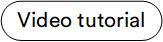
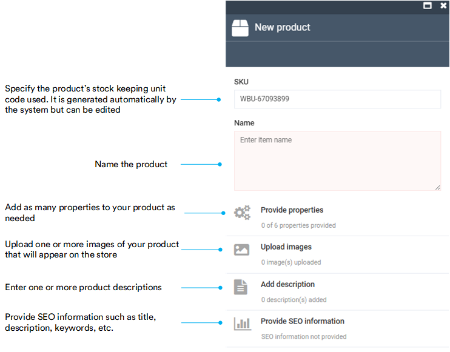
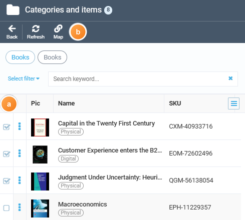
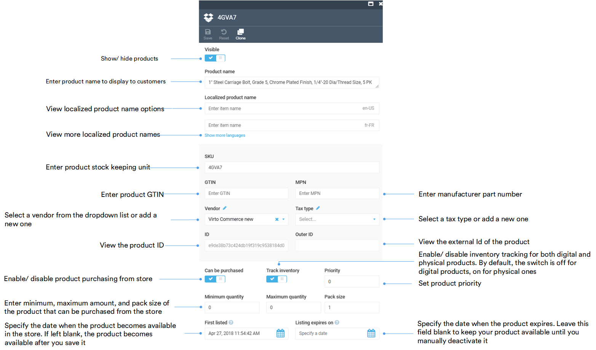
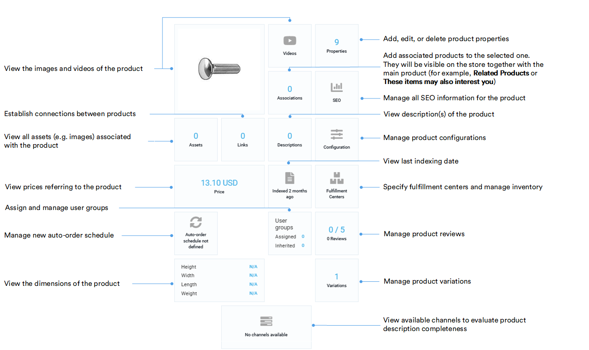
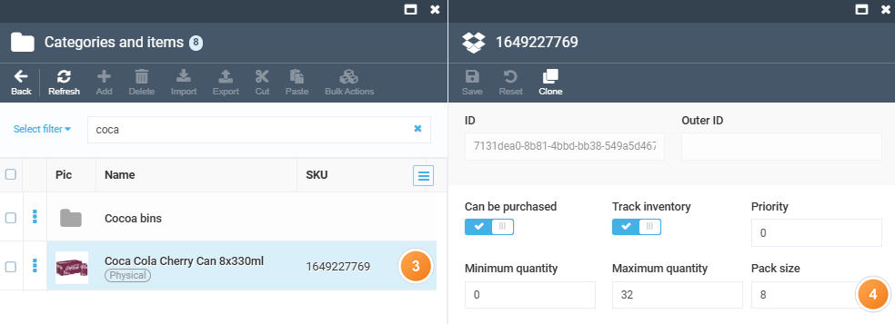
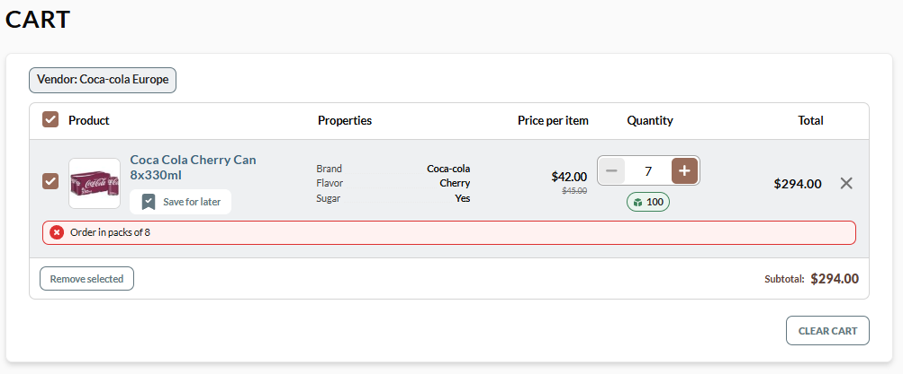

# Manage Products

A product is a basic entity that represents an item that can be purchased in an online store. The Catalog module allows you to work with the following types of products 

- Physical product: Any physical object, such as a camera or a cell phone.
- Digital product: Intangible products, such as software or music.
- Product with a bill of materials: A special type of product that has a list of additional materials required for a specific item.

{: width="25"} [Managing product variations](managing-product-variations.md)

{: width="25"} [Managing product configurations](managing-product-configurations.md)

{: width="25"} [Assigning user groups to products](../catalog-personalization/user-groups.md)

## Add item to physical catalog

To add a new product to your catalog:

1. Click **Catalog** in the main menu.
1. In the next blade, select the required catalog to open the **Categories and Items** blade.
1. Click **Add** in the toolbar.
1. In the **New category item** blade, select the type of item to add:

	| Item           | Description                                                                                                                              |
	|----------------|------------------------------------------------------------------------------------------------------------------------------------------|
	| **Category**   | A container for other categories, products, or variations.                                                                               |
	| **Physical product**               | A tangible item that can be purchased. It requires physical shipping and can be used for targeted promotions.        |
	| **Digital product**                | An intangible item available for purchase. It can be downloaded directly after purchase, so it does not require physical shipping. Digital products are also suitable for targeted promotions. |
	| **Product with bill of materials** | A physical product that comes with a bill of materials (a list of additional items). It can be used for specific promotions and requires physical shipping.      |

1. In the **New product** blade, fill in the following fields:

	{: style="display: block; margin: 0 auto;" }

1. Click **Create** to save the changes.

The product has been added to the selected category or catalog.

## Add item to virtual catalog

A virtual catalog does not store its own products. You structure it with categories and pull in existing items from physical catalogs through links.

To add an item to a virtual catalog:

1. Click **Catalog** in the main menu.
1. In the next blade, select the required virtual catalog to open the **Categories and Items** blade.
1. Click **Add** in the toolbar.
1. In the **New category item** blade, select the type of item to add:

	| Item         | Description                                                |
	|--------------|------------------------------------------------------------|
	| **Category** | A container for other categories, products, or variations. |
	| **Link**     | A link to a physical category or product.                  |

1. Complete the item:

	* For a **Category**, fill in the category name and click **Create**.
	* For a **Link**:
		
		1. Find products to add and check them.
		1. Click **Map** in the toolbar:

		{: style="display: block; margin: 0 auto;" }

The item has been added to the virtual catalog.

## View product details

To view the product details of the added product:

1. Follow steps 1-3 from the instruction above.
1. In the **Categories and items** blade, click the required product.

    !!! tip
        In this step, you can copy the current URL and paste it into a new window to open the desired product immediately.  

1. The product details may be logically divided into two parts:

	* Fields and toggles:
		
	* Widgets:
		

## Set up product pack size

To ensure that orders are placed in the correct quantities, set a pack size for a product:

1. In the main menu, click **Catalog**.
1. In the next blade, select the required catalog.
1. In the next blade, select the required product.
1. In the next blade, set pack size.

	{: style="display: block; margin: 0 auto;" }

1. Click **Save** in the toolbar.

This helps suppliers fulfill orders smoothly without needing to cancel or unexpectedly adjust quantities:

{: style="display: block; margin: 0 auto;" }

 
 
********

    <a href="../product-management-overview">← Product management options </a>
    <a href="../managing-product-variations">Managing product variations →</a>

