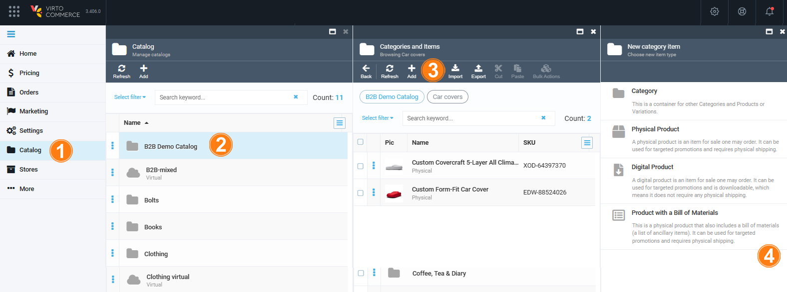
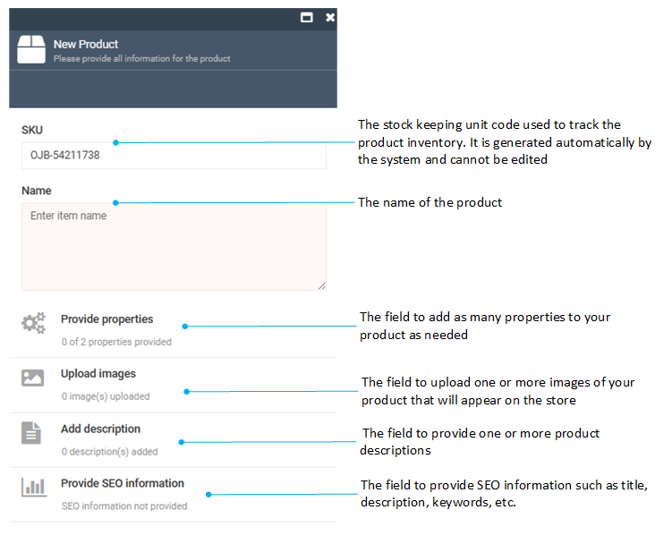
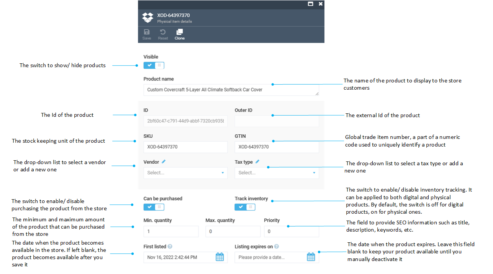
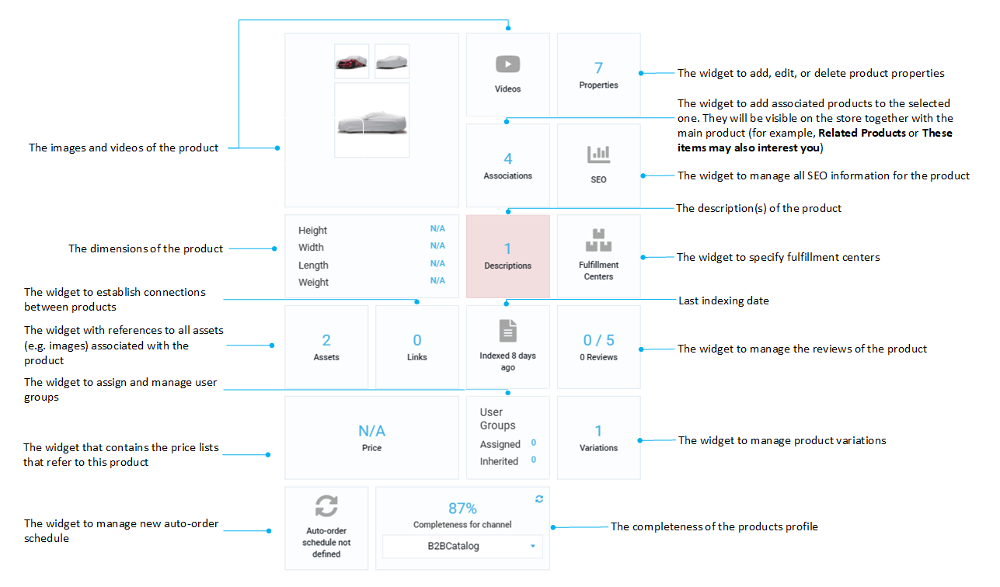
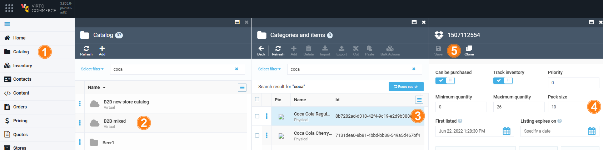
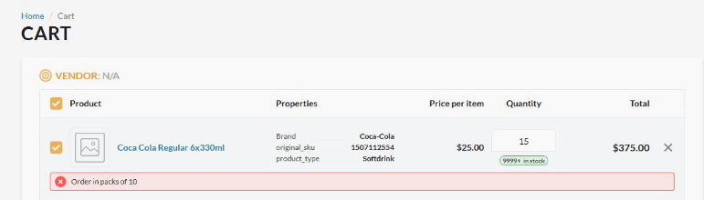

# Manage Products

A product is a basic entity that represents an item that can be purchased in an online store. The Catalog module allows you to work with the following types of products 

- Physical product: Any physical object, such as a camera or a cell phone.
- Digital product: Intangible products, such as software or music.
- Product with a bill of materials: A special type of product that has a list of additional materials required for a specific item.

Variations are individual product entities linked to their master product. For instance, a master product like a mobile phone can have variations like black, white, or red versions, or 5’’ and 6’’ models (or both).
Variations inherit property values from the master product, including descriptions and assets, while also allowing overrides when necessary.

{: width="25"} [Managing product variations](managing-product-variations.md)

{: width="25"} [Assigning user groups to products](../catalog-personalization/user-groups.md)

## Add product

To add a new product to your catalog:

1. Click **Catalog** in the main menu.
1. In the next blade, select the required catalog to open the **Categories and Items** blade.
1. Click **Add** in the toolbar.
1. In the **New category item** blade, select the type of the product to add. 

 	
 
1. In the **New Product** blade, fill in the following fields:

	

1. Click **Create** to save the changes.

The product has been added to the selected category or catalog.

## View product details

To view the product details of the added product:

1. Follow steps 1-3 from the instruction above.
1. In the **Categories and items** blade, click the required product.

    !!! tip
        In this step, you can copy the current URL and paste it into a new window to open the desired product immediately.  

1. The product details may be logically divided into two parts:

	* Fields and toggles:
		
	* Widgets:
		

## Setup product pack size

To ensure that orders are placed in the correct quantities, set a pack size for a product:

1. In the main menu, click **Catalog**.
1. In the next blade, select the required catalog.
1. In the next blade, select the required product.
1. In the next blade, set pack size.
1. Click **Save** in the toolbar.

This helps suppliers fulfill orders smoothly without needing to cancel or unexpectedly adjust quantities:

