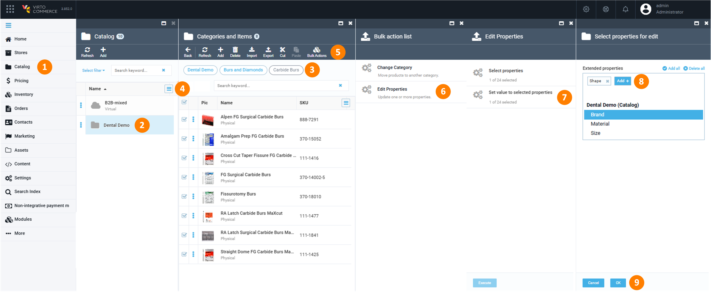

# Manage Properties

For enhanced product filtering and search, let's configure properties within our catalog. They allow customers to filter and search for products based on specific attributes. In the Frontend Application, they are displayed as filtering facets. In this guide, we are going to create the following properties displayed as facets:

Properties can be set for:

* **Catalog**. The properties apply universally across multiple categories or to all products in the catalog. 
* **Category**. The properties apply to attributes specific to products within a particular category.
* **Product**. The properties are unique to individual items and not used frequently for filtering (e.g., a specific product model).
* **Variation**. The properties apply to different versions of a product, like color, or pack size.

For demonstration purposes, we are going to add the following properties:

<table border="1" style="border-collapse: collapse; width: 100%;">
    <tr>
        <th>Level</th>
        <th>Property Type</th>
        <th>Properties</th>
    </tr>
    <!-- Catalog Level -->
    <tr>
        <td rowspan="4" style="border-right: none; border-bottom: none;">Catalog</td>
        <td>Catalog Properties</td>
        <td>-</td>
    </tr>
    <tr>
        <td>Category Properties</td>
        <td>-</td>
    </tr>
    <tr>
        <td>Product Properties</td>
        <td>Brand, Material, Size</td>
    </tr>
    <tr style="border-bottom: 2px solid black;">
        <td>Variation Properties</td>
        <td>-</td>
    </tr>
    <!-- Anesthetics Category Level -->
    <tr>
        <td rowspan="3" style="border-right: none; border-bottom: none;">Anesthetics category</td>
        <td>Category Properties</td>
        <td>-</td>
    </tr>
    <tr>
        <td>Product Properties</td>
        <td>Brand (inherited), Material (inherited), Size (inherited), Date of preparation, Physical state</td>
    </tr>
    <tr style="border-bottom: 2px solid black;">
        <td>Product Variation Properties</td>
        <td>-</td>
    </tr>
    <!-- Burs and Diamonds Category Level -->
    <tr>
        <td rowspan="3" style="border-right: none; border-bottom: none;">Burs and diamonds category</td>
        <td>Category Properties</td>
        <td>Shape</td>
    </tr>
    <tr>
        <td>Product Properties</td>
        <td>-</td>
    </tr>
    <tr style="border-bottom: 2px solid black;">
        <td>Variation Properties</td>
        <td>-</td>
    </tr>
    <!-- Crown and Bridge Materials Category Level -->
    <tr>
        <td rowspan="3" style="border-right: none; border-bottom: none;">Crown and bridge materials category</td>
        <td>Category Properties</td>
        <td>-</td>
    </tr>
    <tr>
        <td>Product Properties</td>
        <td>Length</td>
    </tr>
    <tr style="border-bottom: 2px solid black;">
        <td>Variation Properties</td>
        <td>-</td>
    </tr>
    <!-- Products Level -->
    <tr>
        <td rowspan="2" style="border-right: none;">Products</td>
        <td>Product Properties</td>
        <td>Brand (inherited), Material (inherited), Size (inherited), Date of preparation (inherited), Physical state (inherited)</td>
    </tr>
    <tr>
        <td>Variation Properties</td>
        <td>-</td>
    </tr>
</table>

### Configure properties for catalog

Let's add a **Brand** property at the catalog level:

1. Click **Catalog** in the main menu.
1. In the next blade, click on the three dots to the left of the required catalog and select **Manage** from the dropdown list.  
1. In the next blade, click on the **Properties** widget. 
1. In the next blade, click **Add property** in the toolbar.
1. In the next blade, select **Product property**.

    

1. In the next blade, enter property name, switch the **Dictionary** option to on, and select **Short text**  [value type](#value-type-selection):

    

1. Click **Save** in the toolbar.
1. Click **Dictionary**, then click **Add** in the next blade toolbar to add brand options:

    

    Click **Save** in the toolbar to add the dictionary entry to the list. Continue to add options as required:

    

The property appears in the list. On the frontend, the **Brand** facet becomes collapsible and the properties are displayed as follows:

Continue to add properties and their values according to the table above.

#### Value type selection

When adding product properties, you can select the following value types from the dropdown list:

| **Value type**   | **Description**                                                | **Example**                                   |
|------------------|----------------------------------------------------------------|-----------------------------------------------|
| Short text       | Single-line text, ideal for short descriptive values.          | Brand: Alpen, Premier                         |
| Long text        | Multi-line text, suitable for longer descriptions or notes.    | Product description: “High-quality stainless steel instruments…” |
| Decimal number   | Numerical value with decimals, used for precise measurements.  | Length: 100 mm                                |
| Date time        | Date and time entry, useful for events or production dates.    | Date of production: 2024-11-01 10:00          |
| Boolean          | True/false value, suitable for binary attributes.              | Requires assembly: false                      |
| Integer          | Whole number, ideal for quantities or counts.                  | Pack size: 10                                 |
| Geo Point        | Geographical coordinates (latitude and longitude) for location-based data.| Store location: 40.7128° N, 74.0060° W  |

### Configure properties for category

Let's add a **Date of preparation** property to the **Anesthetics** category:

1. Click **Catalog** in the main menu.
1. In the next blade, select the required catalog.  
1. In the next blade, click on the three dots to the left of the required category and select **Manage** from the dropdown list.  
1. In the next blade, click on the **Properties** widget. 
1. In the next blade, click **Add property** in the toolbar.
1. In the next blade, select **Category property**.

    

1. In the next blade, enter property name and select **Date time** value type from the dropdown list:

    

1. Click **Save** in the toolbar.

The property appears in the list. Continue to add properties according to the table above.

### Add properties to products

Now, we will add properties to the products:

1. In your catalog, select the product you want to add properties to (**OraVerse** in our example).
1. In the product details blade, click on the **Properties** widget.
1. In the next blade, you fill in the properties you have added in the previous steps. From the dropdown lists, select the product's brand and its physical state. Enter date of preparation by clicking {: width="25"}:

    

1. Click **OK** to save the changes.

The properties have been added to your product. Continue to add properties and their values to your products manually or use the instruction below to bulk add properties to products.

#### Bulk add properties to products

To add similar properties and property to a group of products:

1. Click **Catalog** in the main menu.
1. Select your catalog from the list of catalogs (**Dental Demo** in our example).
1. In the next blade, select the required category.
1. In the next blade, check (or bulk select) the products you want to add similar properties to.
1. Click **Bulk actions** in the toolbar.
1. In the next blade, click **Edit properties**.
1. In the next blade, click **Select properties**
1. In the next blade, add all or some previously added product properties.
1. Click **OK** to add the properties to the group of products.

    

1. In the next blade, specify values for the selected properties, then click **OK**.

    

1. Click **Execute** in the previous blade.

The properties have been added to the selected products.

## Configure facets

To set the visibility of facets:

1. Go to **Stores** --> **Your store (Dental Demo Store)** --> **Aggregation properties** widget.
1. In the next blade, click on the properties in the left column (available properties) to move them to the right column (properties visible on the frontend):

    

1. Click **Save** in the toolbar to save the changes.

The selected facets are now displayed in the Frontend Application.

## View results on frontend

1. In the main menu, click **Stores**.
1. In the next blade, click on the required store (**Dental Demo Store** in our case).
1. In the next blade, click **Open in browser** in the top toolbar.

The properties are displayed as facets:

The product properties are also displayed in the product cards:

## Normalize facets

Sometimes, different properties represent the same information but are written in various ways. For example, a product's country of origin might be listed as US, USA, or Made in USA:

To improve product filtering, users can merge multiple values into one:

=== "from the Stores module"

    1. In the main menu, click **Stores**.
    1. In the next blade, click on the three dots to the left of the required store and select **Manage** from the dropdown list.  
    1. In the next blade, click on the **Aggregation properties** widget. 
    1. In the next blade, select the **Country of origin** property.
    1. In the next blade, click **Value mapping** in the toolbar. 
    1. In the next blade, click **Add** in the toolbar.

        

    1. In the next blade, add all the available synonyms to the **USA** by clicking **Add** in the toolbar:

        

    1. Click **OK**, then **Save** in the previous blade to save the changes.
    1. [Rebuild index](../search/managing-search.md#build-search-index).

=== "from Search Index"

    1. In the main menu, click **Search index**.
    1. In the next blade, click on the three dots to the left of the **Product** item and select **Value mapping** from the dropdown list.  
    1. In the next blade, select the item to map values for (**Country of origin** in our case). 
    1. In the next blade, click **Add** in the toolbar.

        

    1. In the next blade, add all the available synonyms to the **USA** by clicking **Add** in the toolbar:

        

    1. Click **OK**, then **Save** in the previous blade to save the changes.
    1. [Rebuild index](../search/managing-search.md#build-search-index).

Now, the **Country of origin** facet shows only **USA**, which includes all the other synonym options:

