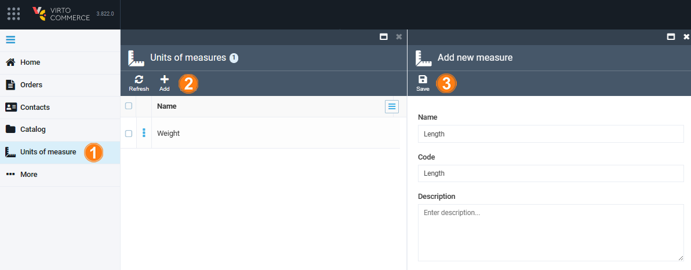
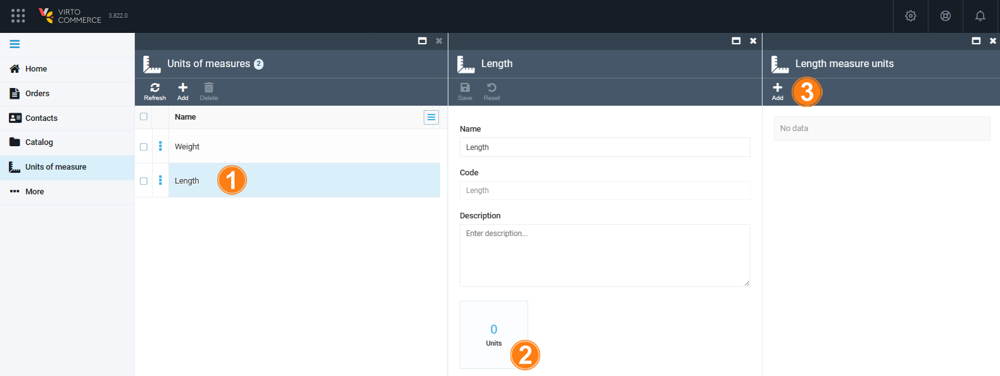
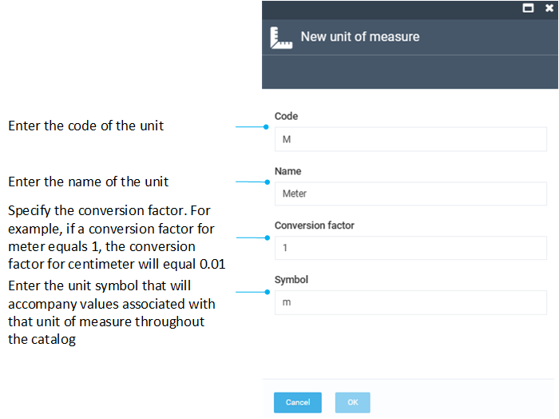
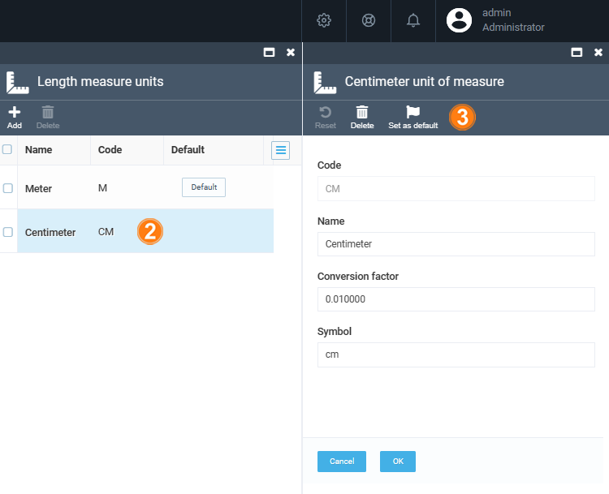

# Manage Units of Measure

The Catalog module allows you to sell products in different units of measure. 

Managing units of measure includes:

* [Adding new units.](managing-units-of-measure.md#add-new-unit-of-measure)
* [Adding measure units to a specific unit of measure.](managing-units-of-measure.md#add-measure-unit-to-specific-unit)
* [Setting measure unit as default.](managing-units-of-measure.md#set-unit-as-default)
* [Deleting units.](managing-units-of-measure.md#set-unit-as-default)

## Add new unit of measure

To add a new unit of measure:

1. Click **Units of measure** in the main menu. 
1. The next blade lists all the registered units of measure. Click **Add** in the toolbar to add a new unit.
1. In the next blade, fill in the required fields, then click **Save** in the toolbar:

Your new unit of measure appears in the list.

## Add measure unit to specific unit 

To extend a unit from the list with new measure units:

1. Click on the desired unit. 
1. In the next blade, click on the **Units** widget.
1. In the next blade, click **Add** in the toolbar.

    

1. Fill in the following fields, then click **OK**:

    

Your new measure unit has been added.

## Set unit as default

The first added measure unit is automatically set as the default. To set another unit as the default:

1. Complete steps 1-2 from the [instruction above](managing-units-of-measure.md#add-measure-unit-to-specific-unit).
1. Click the unit in the list that you want to set as the default.
1. In the next blade, click **Set as default** in the toolbar.

    

1. Click **OK** to save the changes.

The unit has been set as the default.

## Delete Unit

To delete a unit:

1. Complete steps 1-2 from the [instruction above](managing-units-of-measure.md#add-measure-unit-to-specific-unit).
1. Check the unit you want to delete.
1. Click **Delete** in the toolbar.
1. Confirm your action.

The unit has been deleted from the list.