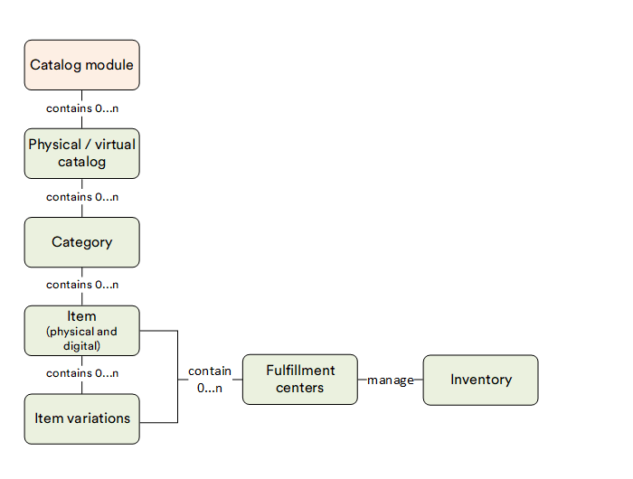

# Overview

The **Catalog** module facilitates the addition of items to your e-commerce store, enabling the marketing of physical goods and digital content. These items can be organized into catalogs and categories, classified based on diverse attributes such as stock availability, item types, vendors, brands, and more.

## Key features

The diagram below illustrates the interconnections among various key entities within the Catalog module:

{: style="display: block; margin: 0 auto;" }

With the Catalog module, you can manage:

* [Physical catalogs.](add-new-catalog.md#physical-catalogs)
* [Virtual catalogs.](add-new-catalog.md#virtual-catalogs)
* [Categories.](managing-categories.md)
* [Products.](managing-products.md)
* [Product availability.](setting-product-availability.md)
* [Search index.](managing-search-index.md)

 
 
********

    <a href="../../platform-overview">← Modules overview </a>
    <a href="../add-new-catalog">Managing catalogs →</a>

