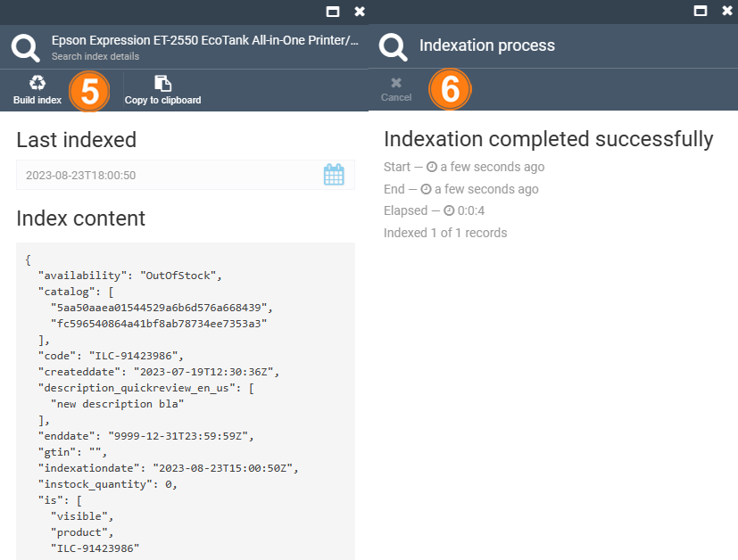

# Product Indexing

Product indexing is used to improve search performance and speed.

The Index widget compares the date of product indexing in the search engine with the current indexing date.

Virto Commerce reindexes automatically whenever one or more items change (e.g., price changes, catalog or shopping cart price rules are created, new categories are added, etc.). Reindexing is performed as a background process. However, indexing can also be done manually using the **Build index** functionality.

To start indexation:

1. Click **Catalog** in the main menu.
1. In the next **Manage catalogs** blade, select the required catalog.
1. In the next **Categories and items** blade, click on the required product.
1. In the next **Physical items details** blade, scroll down and click the index widget.  

    

1. In the next blade, click **Build index** in the toolbar. 
1. The indexation result is displayed in the **Indexation process** blade.

    {: width="550"}

The indexation has been completed.